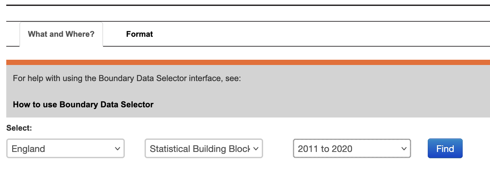

--- 
title: "Crime Mapping in R"
author: "Reka Solymosi and Juanjo Medina"
date: "`r Sys.Date()`"
site: bookdown::bookdown_site
output: bookdown::gitbook
documentclass: book
bibliography: [book.bib, packages.bib]
biblio-style: apalike
link-citations: yes
github-repo: maczokni/crimemapping_textbook_bookdown
description: "Worksheets for labs of Crime Mapping course"
---
# Prelude  {-}

## Introduction 


This workbook contains the lab materials for our Crime Mapping module in Department of Criminology at the University of Manchester. This module is an optional unit open to 3rd year undergraduate and postgraduate students. 

It makes use of R, as it is a free, open source tool, that has tremendous community support, and great versatility in mapping applications. You can find more details about the advantages of R for geospatial work [here](https://geocompr.robinlovelace.net/intro.html)


Crime Mapping introduces students to the concepts of spatial data analysis. The aim is to familiarise students with basic concepts of GIS, and get acquainted with spatial statistics to be able to talk about data about crime, policing, and criminal justice topics situated in the places they occur. Details can be found in the Syllabus.


## Disclaimer 

Please beware that:


- In making these notes, while we briefly cover some concepts, students are expected to do the weekly reading, and attend the weekly lectures, as well as participate in lab disucssions to receive a complete course experience. These notes are *not* intended to be a stand-alone reference or textbook, rather a set of exercises to gain hands-on practice with the concepts introduced during the course.
- These pages are the content of the university course mentioned above. They are meant to (very gently) introduce students to the concept of spatial data analysis, and cover descriptive statsitics and the key concepts required to build an understanding of quantitative data analysis in crime research. 
- The handouts below use, among other data sets, dara from the UK data service such as the Crime Survey for England and Wales that is available under a Open Government Licence. This dataset is designed to be a learning resource and should not be used for research purposes or the production of summary statistics. 


```{r include=FALSE}
# automatically create a bib database for R packages
knitr::write_bib(c(
  .packages(), 'bookdown', 'knitr', 'rmarkdown'
), 'packages.bib')
```

<!--chapter:end:index.Rmd-->

# A first lesson about R

In this lesson, you will be introduced to the programming language, `R`. After installing the related software and getting a basic idea of the R Studio interface, you will learn three `R` basics: operators, objects, and packages. 

Unlike other statistical software like SPSS and STATA, `R` is a free, open-source software for performing statistical analysis and data visualization. In addition, `R` offers more analytical solutions, flexibility, and customization than these commonly used statistical software, and its popularity has increased substantially over the years. 

We learn `R` because we hope that this is an important tool that you will continue to use in future. As it is free and has a community feel to it where anyone can create and upload new techniques, the idea is that you can use `R` long after this course. Even if data analysis is not in the future for you, learning how to conduct and interpret statistical output is a good skill to have – much of our knowledge of the world includes statistics, so understanding the numbers and how they were derived are advantages. `R` uses a language called **object-oriented programming**, and though it may seem daunting at first, practice makes familiarity. Also, you can impress your friends with all your coding. 


## Install R & R Studio


As `R` and `R Studio` are free software, you should be able to install these on your own machines at home. You may be working with different IT, so there are different options to allow a successful install. Our first activity will be to decide what approach to working with `R` and `R Studio` will be best for you. 


### Activity 1: Identifying your operating system

In this activity, you need to answer a question about your computer/IT that you will be working with for this class. That question is: 

- **What is your operating system**? Operating system refers to the software that your computer is running to deliver the basic functions. You may have, for example: 

  + *Windows or Linux* - if you have these, you are most likely going to have an easy time installing `R` and `R Studio`, so you should give the installation instructions below a try
  + *Apple* - if you have a Mac, there are some extra steps to install `R` and `R Studio`. Specifically, there will be an additional programme to download called Xcode, and additional steps to take.  
  + *Chromebook* - Installing `R` and `R Studio` on a Chromebook involves installing Linux. Like with a Mac, there are some additional steps you will need to take, and some patience.
  
In your group google sheets, write down which operating system you have. This will guide which directions to follow later. 


### Activity 2: Install R & R Studio


#### Some notes specific to your operating system. 

Before you move on to the installation steps, look at your answer from Activity 1, and read or watch the advice specific to your operating system:

- Windows: click [here](https://www.youtube.com/watch?v=VLWaED9jTiA) for instructions 
- Chromebook: read the tutorial [here](https://blog.sellorm.com/2018/12/20/installing-r-and-rstudio-on-a-chromebook/)
- Mac, follow the guidance in the video [here](https://www.youtube.com/watch?v=cX532N_XLIs&list=PLqzoL9-eJTNDw71zWePXyHx3_cm_fMP8S) and then, you will also need to install command line tools, for that you can watch another video [here](https://www.youtube.com/watch?v=3Yd9J_dhSfY) 
- Linux: for ubuntu see the video [here](https://www.youtube.com/watch?v=kF0-FH-xBiE) and if you have questions, let the teaching team know!


Once you have watched or read the instructions for your relevant operating system, you are now ready to actually have a go at downloading the software for yourself. Before you start, write in the google doc any questions or concerns, and once ready, install! 


#### Install `R`: {-}

1. Go to [https://www.r-project.org/](https://www.r-project.org/) 

2. Click the [download R](https://cran.r-project.org/mirrors.html) link under the *Getting Started* heading 

3. You will be asked to select a Comprehensive R Archive Network (CRAN) mirror. Click the URL closest to your location

4. Click whichever download link is appropriate for your operating system (see above).

5. Then click the *install R for the first-time* link and proceed to install `R`


#### Install R Studio: {-}

1. Go to [https://rstudio.com/](https://rstudio.com/)

2. Click the *Download* link

3. Scroll down and then click the DOWNLOAD button for the free version of
`RStudio`

4. You will be taken to a website to download the free version of `RStudio` that is appropriate for your computer. Download and then install it.


#### Plan B: accessing R Studio remotely throught a web browser

It might be that the above does not work and you find that there are some issues specific to your computer, or something just is not working. In that case, you have two options: 


- *Option 1:* You can remotely access one of the university PCs from your browser (Firefox, Chrome, Safari, etc). You can find instructions how to do this [here](https://www.itservices.manchester.ac.uk/students/pc-on-campus/remote-cluster-access/) , and the university IT helpdesk can help you access this too. If you do this, you will be able to use the version of `RStudio` installed in the computer clusters. 

- *Option 2*: You can access an online version of `R Studio`, which you can access through any web browser (Firefox, Chrome, Safari, etc). To do this, you visit [https://rstudio.cloud/](https://rstudio.cloud/), click on 'get started for free', choose the free account, and click on 'sign up'. Then you can always visit this website and log in to use `R Studio` in the cloud. Note that you should start a `New Project` and name it *Modelling Crime Data*, and then all your work will be saved in this project. 


## Open up and explore RStudio

In this session we will focus in developing basic familiarity with R Studio. You can use R without using R Studio, but R Studio is an app that makes it easier to work with R. 

R Studio is what we call an IDE, an **integrated development environment**. It is a fancy way of saying that it is a cool interface designed to write programming code. Every time you open up R Studio you are in fact starting a R session. R Studio automatically runs R in the background. We will be interacting with R in this course unit via R Studio.


 

When you first open R Studio, you will see (as in the image above) that there are 3 main windows. The bigger one to your left is the console. If you read the text in the console you will see that R Studio is indeed opening R and you can see what version of R you are running. Since R is constantly being updated the version you installed is likely more recent that the one we used at time of writing.

#### Activity 3: Opening up the script pane

The view in R Studio is structured so that you have 4 open windows in a regular session. However when you first open, you might be starting with only 3. To open the script pane (the one missing) click in the *File* drop down Menu, select *New File*, then *R Script*.


You will now see the 4 window areas in display. On each of these areas you can shift between different views and panels. You can also use your mouse to re-size the different windows if that is convenient.


### The four panes of R Studio

The purposes of the four panes in Figure above are the following:


1. **Script and data view**: where you type your programming code that tells `R` what you want to do. These are essentially instructions that you type and save as a **script**, so that you can return to it later to remember what you did and to share it with others so that they can reproduce what you did.


2. **Environment and history view**: 
  i) *2.1 Environment* tab- gives you the names of all the (data) objects that you have defined during your current `R` session, including number of observations and rows in those objects. We learn more about objects later. 


  ii) *2.2 History* tab- shows you a history of all the code you have previously evaluated in the main console. One of the key advantages of doing data analysis this way - with code versus with a point and click interface like Excel or ArcGIS is that you are producing a written record of every step you take in the analysis. First time around it will take you time to write these instructions, it may be slower than pointing and clicking. And unlike with pointing and clicking you need to know the "words" and "grammar" of this language. 


3. **Main console**: this is considered `R's` heart, and it is where `R` evaluates the codes that you run. You can type your codes directly in the console, but for the sake of good habits, type them in the script and data view so you can save a record of them. Only type and run code from here if you want to debug or do some quick analysis.


4. **File directory, Plots, Packages, Help**:
  i) *4.1 Files* tab-  allows you to see the files in the folder that is currently set as your working directory. 

  ii) *4.2 Plots* tab- you will see any data visualizations that you produce here. You have not produced any yet, so it is empty now.

  iii) *4.3 Packages* tab- you will see the packages that are currently available to install. We will explain what these are soon, but know that they are an essential feature when working with `R`.

  iv) *4.4 Help* tab- you can access further information on the various packages. 


  
#### Activity 4: Interacting with the 4 panes

In the previous activity, you opened up the 'script' pane. We now write some code in it, and see what happens. 

To do this, go to your open version of `R Studio`, and type in the script pane the following: 


```{r hellowrold, eval=F}

print("Hello world!")

```


When you have typed this, you will have typed your first bit of code. Yet nothing is happening? That is because you also have to **RUN** the code. 

You can do this by highlighting the code you wish to run, and clicking on 'run' in the top right hand corner: 


```{r, out.width = "400px", echo = FALSE}

knitr::include_graphics('img/run_hello_world.gif')

```


When you 'run' the code, it will print the text 'Hello World!' in the bottom pane, which is the **console**. That means you have written and executed your first line of code.

In the rest of the session, we will be unpacking how this all works, and getting more familiar and comfortable with using `R Studio`. 


To recap: the **script** is where you write your programming code. A script is nothing but a text file with some code on it. Unlike other programs for data analysis you may have used in the past (Excel, SPSS), you need to interact with R by means of writing down instructions and asking R to evaluate those instructions. R is an *interpreted* programming language: you write instructions (code) that the R engine has to interpret in order to do something. And all the instructions we write can and should be saved in a script, so that you can return later to what you did.

One of the key advantages of doing spatial data analysis this way - with code versus with a point and click interface like ArcGIS or MapInfo (or even QGIS) is that you are producing a written record of every step you take in the analysis. First time around it will take you time to write these instructions, it may be slower than pointing and clicking. And unlike with pointing and clicking you need to know the "words" and "grammar" of this language. 

The advantage of doing analysis this way is that once you have written your instructions and saved them in a file, you will be able to share it with others and run it every time you want in a matter of seconds. This creates a *reproducible* record of your analysis: something that your collaborators or someone else anywhere (including your future self, the one that will have forgotten how to do the stuff) could run and get the same results than you did at some point earlier. This makes science more transparent and transparency brings with it many advantages. For example, it makes your research more trustworthy. Don't underestimate how critical this is. **Reproducibility** is becoming a key criteria to assess good quality research. The University of Manchester [just joined the UK Reproducibility Network](https://www.staffnet.manchester.ac.uk/news/display/?id=25496), and is promoting this good practice. If you're interested you can join [the Open Science working group](https://research-it.manchester.ac.uk/news/2019/05/30/uom-open-science-working-group/) or the reading club [ReproducibiliTea](https://reproducibilitea.org/journal-clubs/#Manchester). You can read up on reproducibility and its importance [here](http://theconversation.com/the-science-reproducibility-crisis-and-what-can-be-done-about-it-74198) or get Stuart Richie's book [Science Fictions](https://www.goodreads.com/book/show/52199285-science-fictions) for an engaging further read.


## Customising the RStudio look

R Studio allows you to customise the way it looks. Working with white backgrounds is not generally a good idea if you care about your eyesight. If you don't want to end up with dry eyes not only it is good you follow the 20-20-20 rule (every 20 minutes look for 20 seconds to an object located 20 feet away from you), but it may also be a good idea to use more eye friendly screen displays. 

Click in the *Tools* menu and select *Global options*. This will open up a pop up window with various options. Select *Appearance*. In this section you can change the font type and size, but also the kind of theme background that R will use in the various windows. 


You can make any changes you'd like to here, including the theme background that `R` will use as the interface.

For example, you may choose a darker theme like 'tomorrow night bright'.


As indicated above, the window in the bottom left corner is the main **console**.You will see that the words "I hate computers" appear printed there.  If rather than using R Studio you were working directly from R, that's all you would get: the main console where you can write code interactively (rather than all the different windows you see in R Studio). You can write your code directly in the main console and execute it line by line in an interactive fashion. However, we will be running code from scripts, so that you get used to the idea of properly documenting all the steps you take,


### Functions

**Functions**  *do* things. They are called by a certain name, usually a name which represents what they do, and they are followed by brackets `()`. Within the brackets, you can put whatever it is that you want the function to work with. For example, the code we wrote in Activity 4 was the `print()` function. This function told `R` to print into the console whatever we put in the brackets ("Hello World!"). 


Same idea with a personalised greeting: if you want to print 'Hello Reka', you will need to have "Hello Reka" inside the brackets:


```{r helloreka}

print("Hello Reka")

```


There are so many functions in `R`. We will be learning many of them throughout our class. `Print` is fun, but most of the time, we will be using functions to help us with our data analysis. For example, getting the minimum, maximum, or mean of a list of numbers. `R` does this using functions in a very similar way. 

For example, if we have a bunch of numbers, we just find the appropriate function to get the summary we want: 


```{r examplefuns}

mean(10, 34, 5, 3, 77)
min(10, 34, 5, 3, 77)
max(10, 34, 5, 3, 77)


```


How can you find the function you need? Throughout this class, you will learn a list that appears at the top of each lesson. A recommendation is to also create a 'function cookbook', where you write down a list of functions, what the functions do, and some examples. Here is an example: 


You can use google to make your cookbook, and the website [stackoverflow](https://stackoverflow.com/), in particular, can help you find the function you need. But be wary, especially in the beginning, that you understand what the function does. There can be several different functions for the same action. One good approach is to add a function of interest to your cookbook and ask the teaching team about what it does, and how it might be different to other functions that do the same thing.


#### Activity 5: Play around with functions

Have a guess (or google) about what you think is the function to get the median. Once you have your answer, write it in the shared google docs. Then, use it to get the median of the numbers 10, 34, 5, 3, 77. 

Write the answer in your shared google doc (or note it down for yourself if in the quiet room).

The answer is further below, after the note: 


**NOTE:** `R` is case-sensitive! For example:


```{r eval=FALSE}

# Calculating the logarithm 
Log(100)

# ERROR!
```


```{r}
# Instead, it should be:
log(100)

```


 Okay, now you know these, the answer to Activity 5 was...
 
 
 
```{r activity6ans}

median(10, 34, 5, 3, 77)
 
```


 
Now let us move on to our second key topic: objects! 


### Objects 


Everything that exists in `R` is an **object**. Think of objects as boxes where you put things in. Imagine a big, empty cardboard box. We can create this big empty box in R by simply giving it a name. Usually, you want your object/box to have a good descriptive name, which will tell people what is in it. Imagine moving house. If you have a cardboard box full of places, you might want to label it "plates". That way, when carrying, you know to be careful, and when unpacking, you know its contents will go in the kitchen. On the other hand, if you named it "box1", then this is a lot less helpful when it comes to unpacking. 


#### Activity 6: Creating an object

Let us create an object called 'plates'. To do this, you go to your script, and type 'plates'. 


But if you run this code, you will get an error. Let's see: 

```{r, out.width = "400px", echo = FALSE}

knitr::include_graphics('img/error_no_plates.gif')

```


You see the error 'Error! Object plates not found'. This is because you have not yet put anything inside the plates 'box'. Remember objects are like boxes,so there must be something inside our object 'plates'. In order for this object to exist, you have to put something inside it, or in `R`-speak *assign it some value*.

Therefore, we make an object by using an *assignment operator* ( `<-` ). In other words, we assign something to an object (i.e., put something in the box). For example:


```{r addplates}

plates <- "yellow plate"

```


Now if we run this, we will see no error message, but instead, we will see the `plates` object appear in our *environment pane*: 

```{r, out.width = "400px", echo = FALSE}

knitr::include_graphics('img/assign_plates.gif')

```


Here are some more examples to illustrate: 


```{r}

# Putting '10' in the 'a' box
a <- 10

# Putting 'Hello!' in the 'abc123' box
abc123 <- "Hello!"

```


In these examples, we are putting the value of `10` into the object `a`, and the value of 'Hello!' into the object `abc123`. 

Earlier, we introduced you to the Environment and History pane. We mentioned that it lists objects you defined. After making the 'a' and 'abc123' objects, they should appear in that very pane under the `Environment` tab. 


#### Types of objects

Why are objects important? We will be storing everything in our data analysis process in these objects. Depending on what is inside them, they can become a different type of object. Here are some examples: 

**Data structures** are important objects that store your data, and there are five main types but we focus on three for this course:

1. *(atomic) vector*: an ordered set of elements that are of the same *class*. Vectors are a basic data structure in `R`. Below are five different classes of vectors:


```{r}

# 1. numeric vector with three elements
my_1st_vector <- c(0.5, 8.9, 0.6) 

# 2. integer vector with addition of L at the end of the value
my_2nd_vector <- c(1L, 2L, 3L)  

# 3. logical vector
my_3rd_vector <- c(TRUE, FALSE, FALSE) 
# 'my_4th_vector' creates a logical vector using abbreviations of True and False, but you should use the full words instead
my_4th_vector <- c(T, F) 

# 4. character vector
my_5th_vector <- c("a", "b", "c") 

# 5. complex vector (we will not use this for our class)
my_6th_vector <- c(1+0i, 2+4i) 

```


2. *lists*: technically they, too, are vectors but they are more complex because they are not restricted on the length, structure, or class of the included elements. For example, to create a list containing strings, numbers, vectors and a logical, use the `list()` function, and inside the brackets, put everything tat you want to combine into a list:


```{r}

list_data <- list("teal", "sky blue", c(10, 5, 10), TRUE, 68.26, 95.46, 99.7) 
```


Above, we created `list_data`, an object that contains all those things that we put inside the `list()` function. This function serves to create a list from combining everything that is put inside its brackets. 

Use the `class()` function to confirm that the objects have been defined as a list

```{r}

class(list_data)

```


3. *data frames*: also stores elements but differ from lists because they are defined by their number of columns and rows; the vectors (columns) must be of the same length. Data frames can contain different classes but each column must be of the same class. For example, if you want to combine some related vectors to make a data frame on violent American cities, use the function `data.frame()`:


```{r}

# Making some relevant vectors
TopVioCities <- c("St. Louis", "Detroit", "Baltimore") # some violent US cities
VioRatePer1k = c(20.8, 20.6, 20.3) # their violence rates per 1,000 persons
State <- c("Missouri", "Michigan", "Maryland") # in what states are these cities found

#Join them to make a data frame called 'df'
df<-data.frame(TopVioCities, VioRatePer1k, State)

```


We can then view the data frame, 'df', with the `View()` function:


```{r viewfn, eval = F}
View(df)

```


#### Activity 7: Doing things to objects

We have learned what functions are (i.e., things that do things) and what are objects (i.e., the boxes that hold things). We also saw some functions which helped us create objects. Functions can also do things to objects. For example, we saw the function `class()` that told us about what kind of object list_data was, and `View()` which allowed us to have a look at our dataframe we called `df`.

Let us look back at our `plates` object. Remember it was the object that held our kitchen items. We added 'yellow plate' to it. Now let us add some more items and let us use the concatenate `c()` function for this again: 


```{r}

plates <- c("yellow plate", "purple plate", "silver plate", "orange bowl")

```


Let us say that we suddenly forgot what was in our object called 'plates'. Like what we learned earlier, we use the function `print()` to see what is inside this object:


```{r printplates}

print(plates)

```


This can apply to obtaining the mean, the minimum, and maximum. You could assign those statistics to an object this time:


```{r listnums}

nums <- c(10, 34, 5, 3, 77)

```


Now if we want to know the mean, we can take the mean of the object `nums`, which we just created:


```{r meannms}

mean(nums)

```


The object we will use most frequently though is data frames. These hold your data in a format whereby each column represents a variable, and each row an observation. 

Just earlier, we had created a dataframe called `df` previously. If you have not yet copied this over into your own `R Studio`, do this now. You should have the object `df` in your environment. When you run `View(df)`, you should see this dataset:


To do something to an entire dataframe, we would use the name of the object (`df`) to refer to it. In the case of the `View()` function, we want to see the whole thing, so we will call `View(df)`. On the other hand, if we want to refer to only one variable in the data, (remember back to term 1 - each varible is held in each column) there is a special notation to do this. 

To refer to a variable (column) inside a dataframe, you use:


$dataframe name + \$ + variable name$


For example, to refer to the variable `VioRatePer1k`, we use the notation `df$VioRatePer1k`. 

And if we wanted to View only that column, we use: 


```{r viewonecol, eval = FALSE}

View(df$VioRatePer1k)

```

You should see: 


Say we wanted to know the mean violence rate across our units of analysis, the cities, for example, we would take the numeric column to calculate this: 


```{r meanviol}

mean(df$VioRatePer1k)

```


## Packages 


**Packages** are a very important element of `R`. 


Packages are elements that add the functionality of R. What most packages do is they introduce new functions that allow you to ask R to do new different things. Anybody can write a package, so consequently R packages vary on quality and complexity. You can find packages in different places, as well, from official repositories (which means they have passed a minimum of quality control), something called Git Hub (a webpage where software developers post work in progress), to personal webpages (danger danger!). 


Throughout the course, and hopefully afterwards, you will find yourself installing numerous open source software packages that allow `R` to do new and different things. There are loads of packages out there. In early 2020, there were over 150,000 packages available. Anyone can write one, so you will need to be careful on which ones you use as the quality can vary. Official repositories, like [CRAN](https://cran.r-project.org/), are your best bet for packages as they will have passed some quality controls. 

You can see what packages are available in your local install by looking at the *packages* tab in the *File directory, Plots, Packages* pane. 


{width=35%}


A number of the packages we will use belong to a set of packages called **tidyverse**. These packages help make your data tidy. According to Statistician and Chief Scientist at `RStudio`, Hadley Wickham, transforming your data into *tidy data* is one of the most important steps of the data analysis process. It will ensure your data are in the format you need to conduct your analyses. We will also be using the simple features package **sf** and many more associated with spatial data analysis. 

Packages can be installed using the `install.packages()` function. Remember that while you only need to install packages once, they need to be loaded with the `library()`function each time you open up `RStudio`. Let us install the package `dplyr` from `tidyverse` and load it:

```{r}

library(dplyr)

```


A lot of code and activity appears in the console. Warnings may manifest. Most of the time, the warnings explain what is being loaded and confirm that the package is successfully loaded. If there is an error, you will have to figure out what the warnings are telling you to successfully load the package. This happens and is normal.

To double check that you have actually installed `dplyr`, go to that *File Directory, Plots, Packages* pane and click on the *Packages* tab. The list of packages is in alphabetical order and `dplyr` should be there. If there is a tick in its box, it means that this package is currently loaded and you can use it; if there is no tick, it means that it is inactive, and you will have to bring it up with `library()`, or just tick its box (Figure 1.6). 


{width=35%}


 
On *masking*:  sometimes packages introduce functions that have the same name as those that are already loaded into your session. When that happens, the newly loaded ones will override the previous ones. You can still use them but you will have to refer to them explicitly by bringing them up by specifying to which package they belong with `library()`.


How do you find out what a package does? You look at the relevant documentation. In the Packages window scroll down until you find the new package we installed listed. Here you will see the name of the package (dplyr), a brief description of what the program is about, and the version you have installed (an indication that a package is a good package is that it has gone through several versions, that means that someone is making sure the package gets regular updates and improvements). 

Click in the name *dplyr*. You will see that R Studio has now brought you to the Help tab. Here is where you find the help files for this package, including all the available documentation.


## Exploring data

Now that we know the basic component, let's play around with using R as we will throughout the course, for some data analysis. 

We will get some data by installing a package which has data in it as well as functions, and then go on to produce some basic summaries. This should give some practice!

### Activity 8: Playing around with data


We are going to look at some data that are part of the *fivethirtyeight* package. This package contains data sets and code behind the stories in [this particular online newspaper](http://fivethirtyeight.com/). This package is not part of the base installation of R, so you will need to install it first. I won't give you the code for it. See if you can figure it out by looking at previous examples. Discuss and write in the google doc what you think the code will be. 


Done? Ok, now we are going to look at the data sets that are included in this package. Remember first we have to load the package if we want to use it:

```{r}
library("fivethirtyeight")
data(package="fivethirtyeight") #This function will return all the data frames that are available in the named package.
```

Notice that this package has some data sets that relate to stories covered in this newspaper that had a criminological angle. Let's look for example at the `hate_crimes` data set. How do you that? First we have to load the data frame into our global environment. To do so use the following code:

```{r}
data("hate_crimes")
```

This function will search among all the *loaded* packages and locate the `hate_crimes` data set. Notice that it now appears in the global environment, although it also says "promise" next to it. To see the data in full you need to do something to it first. So let's do that.

Every object in R can have **attributes**. These are: names; dimensions (for matrices and arrays: number of rows and columns) and dimensions names; class of object (numeric, character, etc.); length (for a vector this will be the number of elements in the vector); and other user-defined. You can access the attributes of an object using the `attributes()` function. Let's query R for the attributes of this data frame.

```{r}
attributes(hate_crimes)

```


This prints out the row names (not very exciting here..) the class (see above when we used `class()` function) and the names, which are the column headers - or the *names of the variables within this data set*. You can see there are things like state, and share who voted trump (in the 2016 election, not most recent!). 

Now use the `View()` function to glance at your data frame. What you get there is a spreadsheet with 12 variables and 51 observations. Each variable in this case is providing you with information (demographics, voting patterns, and hate crime) about each of the US states.  


Ok, let's now have a quick look at the data. There are so many different ways of producing summary stats for data stored in R that is impossible to cover them all! We will just introduce a few functions that you may find useful for summarising data. Before we do any of that it is important you get a sense for what is available in this data set. Go to the help tab and in the search box input the name of the data frame, this will take you to the documentation for this data frame. Here you can see a list of the available variables.


Let's start with the *mean*. This function takes as an argument the numeric variable for which you want to obtain the mean. You have done this above, so it should be familiar now! If you want to obtain the mean of the variable that gives us the proportion of people that voted for Donald Trump you can use the following expression:

```{r}

mean(hate_crimes$share_vote_trump)

```

Another function you may want to use with numeric variables is `summary()`:

```{r}
summary(hate_crimes$share_vote_trump)
```

This gives you the five number summary (minimum, first quartile, median, third quartile, and maximum, plus the mean and the count of missing values if there are any). 

You don't have to specify a variable you can ask for these summaries from the whole data frame:

```{r}
summary(hate_crimes)
```

There are multiple ways of getting results in R. Particularly for basic and intermediate-level statistical analysis many core functions and packages can give you the answer that you are looking for. For example, there are a variety of packages that allow you to look at summary statistics using functions defined within those packages. You will need to install these packages before you can use them. 

I am only going to introduce one of them here `skimr`. You will need to install it before anything else. 

```{r, echo=FALSE}
library(skimr)

```


Once you have loaded the *skimr* package you can use it. Its main function is *skim*. Like *summary* for data frames, skim presents results for all the columns and the statistics will depend on the class of the variable. 

```{r, eval=FALSE}
skim(hate_crimes)
```


Hopefully in your statistical modules you had taken previously, you have learned some things about how to graphically display variables. So you may have some memory about the amount of work involved with this. Hopefully R will offer some respite. Of course, there are many different ways of producing graphics in R. In this course we rely on a package called *ggplot2*, which is part of the tidyverse set of packages mentioned earlier. 

```{r}

library(ggplot2)

```

Then we will use one of its functions to create a scatterplot. 

```{r}
ggplot(hate_crimes, aes(x=share_vote_trump, y=avg_hatecrimes_per_100k_fbi)) +
    geom_point(shape=1) +
     geom_smooth(method=lm)
```

What do you think this graphic is telling you? Discuss and write in your shared google docs. 


Graphing is very powerful in R, and much of the spatial visualisation we will produce throughout the module will build on this. If you are not already familiar with this, I recommend a read of the data visualisation chapter of R for Data Science [https://r4ds.had.co.nz/data-visualisation.html](https://r4ds.had.co.nz/data-visualisation.html)


## Getting organised: R Projects

One thing that can help you tremendously throughout this module is keeping your code organised.R Studio helps with this by virtue of something called **R Projects**.

Technically, a R Studio project is just a directory with the name of the project, and a few files and folders created by R Studio for internal purposes. This is where you should hold your scripts, your data, and reports. You can manage this folder with your own operating system manager (discussed earlier, e.g., Windows) or through the R Studio file manager (that you access in the bottom right corner set of windows in R Studio).

When a project is reopened, R Studio opens every file and data view that was open when the project was closed last time around. Trust me, this is a really helpful thing! If you create a project for this module, you can keep everything in once place, and refer back to your old code and your learnings throughout the module. 


#### Activity 9: Saving your work and projects

First things first, hopefully you have already created a separate folder on your desktop, or dropbox, or something like this. Now save the script you've been working on into this folder. By clicking on "File" and "Save as...".


Then navigate to your folder for this module, and for your script make sure to give it some meaningful name like week1lab.R or something like this. Then click 'save'.


Now, go back to "File" and select "New project..."


Then in the options that appear choose "Existing Directory". This is because you already have a folder for this work, this is where you saved your script just before. For me this was my folder called 'crime_mapping' you saw above.


So select 'Existing Directory', and on the next page use the "Browse" button to select this folder (the directory) where you saved the script earlier. Once you have done this, click on 'Create Project' on the bottom.


This will now open up a new R Studio window with your project. In the future, you can start right back up where you finished last time by navigating to the .Rproj file, and double clicking it. It helps you keep everything in one place, and lets R read everything from that folder.


With simple projects a single script file and a data file is all you may have. But with more complex projects, things can rapidly become messy. So you may want to create subdirectories within this project folder. I typically use the following structure in my own work to put all files of a certain type in the same subdirectory:

+ *Scripts and code*: Here I put all the text files with my analytic code, including rmarkdown files which is something we will introduce much later in the semester.

+ *Source data*: Here I put the original data. I tend not to touch this once I have obtained the original data.

+ *Documentation*: This is the subdirectory where I place all the data documentation (e.g., codebooks, questionnaires, etc.)

+ *Modified data*: All analysis involve doing transformations and changing things in the original data files. You don't want to mess up the original data files, so what you should do is create new data files as soon as you start changing your source data. I go so far as to place them in a different subdirectory.

+ *Literature*: Analysis is all about answering research questions. There is always a literature about these questions. I place the relevant literature for the analytic project I am conducting in this subdirectory.

+ *Reports and write up*: Here is where I file all the reports and data visualisations that are associated with my analysis.

If you come to my office, you will see it is a very messy place. But my computer is, in contrast, a very tidy environment. You should aim for your computer workspace to be very organised as well. 


You can read up here on why projects are useful here: [https://www.r-bloggers.com/2020/01/rstudio-projects-and-working-directories-a-beginners-guide/](https://www.r-bloggers.com/2020/01/rstudio-projects-and-working-directories-a-beginners-guide/)


<!--chapter:end:01-intro.Rmd-->

# Making Maps in R

This week we will start making some maps in R, and learn about how we can take regular crime data, and assign the appropriate geometry for our chosen unit of analysis. We will produce some maps, using possibly familiar ggplot notation, and learn some key terms around projection and coordinate reference systems which will be essential for your work in the coming weeks. 


Today we will use the following packages, so make sure you have them downloaded: 


- `readr`
- `tibble`
- `janitor`
- `sf`
- `ggplot2`
- `ggspatial`
- `dplyr`


## A quick introduction of terms

### Geospatial Perspective - The Basics

Geospatial analysis provides a distinct perspective on the world, a unique lens through which to examine events, patterns, and processes that operate on or near the surface of our planet. Ultimately geospatial analysis concerns what happens where, and makes use of geographic information that links features and phenomena on the Earth's surface to their locations. 

We can talk about a few different concepts when it comes to spatial information. These are: 

- Place
- Attributes
- Objects


#### Place

At the center of all spatial analysis is the concept of *place*. People identify with places of various sizes and shapes, from the room with the parcel of land, to the neighbourhood, to the city, the country, the state or the nation state. Places often have names, and people use these to talk about and distinguish names. Names can be official. Places also change continually as people move. The basis of rigorous and precise definition of place is a coordinate system, a set of measurements that allows place to be specified unambiguously and in a way that is meaningful to everyone. 

#### Attributes

Attribute has become the preferred term for any recorded characteristic or property of a place. A place's name is an obvious example of an attribute. But there can be other pieces of information, such as number of crimes in a neighbourhood, or the GDP of a country. Within GIS the term 'attributes' usually refers to records in a data table associated with individual elements in a vector map or cells in a grid (raster or image file). These data behave exactly as data you have encountered in your past experience. The rows represent observations, and the columns represent variables. The variables can be numeric or categorical, and depending on what they are, you can apply different methods to making sense of them. The difference with other kind of data table is that the observations, your rows, correspond to places or locations.

#### Objects

In spatial analysis it is customary to refer to places as objects. These objects can be a whole country, or a road. In forestry, the objects of interest might be trees, and their location will be represented as points. On the other hand, studies of social or economic patterns may need to consider the two-dimensional extent of places, which will therefore be represented as areas. These representations of the world are part of what is called the **vector data model**: A representation of the world using points, lines, and polygons. Vector models are useful for storing data that have discrete boundaries, such as country borders, land parcels, and streets. This is made up of points, lines, and areas (polygons): 

- Points
    + Points are pairs of coordinates, in latitude/longitude or some other standard system
- Lines
    + Lines are ordered sequences of points connected by straight lines
- Areas (polygons)
    + Areas are ordered rings of points, also connected by straight lines to form polygons. It can contain holes, or be linked with separate islands. 
    


Objects can also be **raster data**. Raster data is made up of pixels (or cells), and each pixel has an associated value. Simplifying slightly, a digital photograph is an example of a raster dataset where each pixel value corresponds to a particular colour. In GIS, the pixel values may represent elevation above sea level, or chemical concentrations, or rainfall etc. The key point is that all of this data is represented as a grid of (usually square) cells. 

#### Networks

We already mentioned lines that constitute objects of spatial data, such as streets, roads, railroads, etc. Networks constitute one-dimensional structures embedded in two or three dimensions. Discrete point objects may be distributed on the network, representing phenomena such as landmarks, or observation points. Mathematically, a network forms a graph, and many techniques developed for graphs have application to networks. These include various ways of measuring a network's connectivity, or of finding the shortest path between pairs of points on a network. You can have a look at the [lesson on network analysis in the QGIS documentation](https://docs.qgis.org/2.18/en/docs/training_manual/vector_analysis/network_analysis.html)

#### Maps: reference and thematic maps

Historically maps have been the primary means to store and communicate spatial data. Objects and their attributes can be readily depicted, and the human eye can quickly discern patterns and anomalies in a well-designed map. 

In GIS we distinguish between reference and thematic maps. A **reference map** places the emphasis on the location of spatial objects such as cities, mountains, rivers, parks, etc. You use these maps to orient yourself in space and find out the location of particular places. **Thematic maps**, on the other hand, are about the spatial distribution of attributes or statistics. For example, the number of crimes across different neighbourhouds. Our focus in this book is on thematic maps.

#### Map projections and geographic coordinate systems

Whenever we put something into a map we need some sort of system to pinpoint the location. A coordinate system allows you to integrate any dataset with other geographical datasets within a common framework. There are hundreds of them. It is common to distinguish between **geographic coordinate systems** and **projected coordinate systems**. A *geographic coordinate system* is a *three dimensional* reference system that enables you to locate any location on earth. Often this is done with longitude, latitute and elevation. *Projected coordinate systems* or map projections, on the other hand, try to portray the surface of the earth or a portion of the earth on a *two dimensional* flat piece of paper or computer screen. 

All projections of a sphere like the earth in a two dimensional map involve some sort of distortion. You can't fit a three dimensional object into two dimensions without doing so. Projections differ to a large extent on the kind of distortion that they introduce. The decision as to which map projection and coordinate reference system to use, depends on the regional extent of the area you want to work in, on the analysis you want to do and often on the availability of data. Knowing the system you use would allow you to translate your data into other systems whenever this may be necessary. Often you may have to integrate data that is provided to you in different coordinate or projected systems. As long as you know the systems, you can do this.

[Footnote to this for more detail: https://www.youtube.com/watch?v=6tmDxTAjux0]

A traditional method of representing the earth’s shape is the use of globes. When viewed at close range the earth appears to be relatively flat. However when viewed from space, we can see that the earth is relatively spherical. Maps, are representations of reality. They are designed to not only represent features, but also their shape and spatial arrangement. Each map projection has advantages and disadvantages. The best projection for a map depends on the scale of the map, and on the purposes for which it will be used. For your purposes, you just need to understand that essentially there are different ways to flatten out the earth, in order to get it into a 2-dimensional map. 

The process of creating map projections can be visualised by positioning a light source inside a transparent globe on which opaque earth features are placed. Then project the feature outlines onto a two-dimensional flat piece of paper. Different ways of projecting can be produced by surrounding the globe in a cylindrical fashion, as a cone, or even as a flat surface. Each of these methods produces what is called a map projection family. Therefore, there is a family of planar projections, a family of cylindrical projections, and another called conical projections.


With the help of **coordinate reference systems** (CRS) every place on the earth can be specified by a set of three numbers, called coordinates. In general CRS can be divided into **projected coordinate reference systems** (also called Cartesian or rectangular coordinate reference systems) and **geographic coordinate reference systems**.

The use of Geographic Coordinate Reference Systems is very common. They use degrees of latitude and longitude and sometimes also a height value to describe a location on the earth’s surface. The most popular is called **WGS 84**. This is the one you will most likely be using, and if you get your data in latitude and longitude, then this is the CRS you are working in. It is also possible that you will be using a projected CRS. This two-dimensional coordinate reference system is commonly defined by two axes. At right angles to each other, they form a so called XY-plane. The horizontal axis is normally labelled X, and the vertical axis is normally labelled Y. 

Working with data in the UK, on the other hand, you are most likely to be using **British National Grid (BNG)**. The Ordnance Survey National Grid reference system is a system of geographic grid references used in Great Britain, different from using Latitude and Longitude. In this case, points will be defined by "Easting" and "Northing" rather than "Longitude" and "Latitude".  It basically divides the UK into a series of squares, and uses references to these to locate something. The most common usage is the six figure grid reference, employing three digits in each coordinate to determine a 100 m square. For example, the grid reference of the 100 m square containing the summit of Ben Nevis is NN 166 712. Grid references may also be quoted as a pair of numbers: eastings then northings in meters, measured from the southwest corner of the SV square. For example, the grid reference for Sullom Voe oil terminal in the Shetland Islands may be given as HU396753 or 439668,1175316


This will be important later on when we are linking data from different projections, or when you look at your map and you try to figure out why it might look "squished". 

#### Density estimation

One of the more useful concepts in spatial analysis is density - the density of humans in a crowded city, or the density of retail stores in a shopping centre. Mathematically, the density of some kind of object is calculated by counting the number of such objects in an area, and dividing by the size of the area. To read more about this, I recommend [Silverman, Bernard W. Density estimation for statistics and data analysis. Vol. 26. CRC press, 1986.](https://books.google.co.uk/books?id=e-xsrjsL7WkC&dq=silverman+density+estimation+for+statistics&lr=&source=gbs_navlinks_s)

### Summary

Right so hopefully this gives you a few things to think about. Be sure that you are confident to know about: 

 - Spatial objects - what they are and how they are represented
 - Attributes - the bits of information that belong to your spatial objects
 - Maps and projections - especially what WSG84 and BNG mean, and why it's important that you know what CRS your data have
 
## Getting some spatial data to put on a map

Alright let's get some practical experience where we take some crime data, and find out how we can put it on the map!


### Find some relevant data to show: obtaining data on crime

For your first crime map, we better get some real world crime data. This can be done for the UK easily, as anonymised open crime data are released for the public to use. We can play around with police recorded crime data, which can be downloaded from the [police.uk](https://data.police.uk/data/) website. 

Let's download some data for crime in Manchester.

### Activity 1: Get some crime data

To do acquire the data, open the [data.police.uk/data](https://data.police.uk/data/) website. Choose the data tab, in order to download some data. 

- In `Date range` just select one month of data. Choose whatever month you like EXCEPT nothing more recent than June 2019. Unfortunately, for GMP there is no more recent data available than that. This is because they are having some serious IT issues [see this article](https://www.manchestereveningnews.co.uk/news/greater-manchester-news/gmp-finally-switches-new-27m-16632975) which apparently have disrupted this flow of data.
- In `Force` find `Greater Manchester Police`, and tick the box next to it. 
- In `Data sets` tick `Include crime data`.
- Finally click on `Generate File` button.

This will take you to a download page, where you have to click the `Download now` button. This will open a dialogue to save a .zip file. Navigate to the project directory folder you've created and save it there, ideally in a subfolder. I call my subfolder 'data'. 


Unzip the file. You can use the unzip function for this. A cool function you may want to use as well is file.choose(). If we pass this function as an argument to unzip(), we will get a pop window where we will be able to select our file using familiar point and click. Ideally, you want to rather write down the path to your file. But sometimes these shortcuts are convenient.

```{r, eval=FALSE}

unzip(file.choose())

```

If you look at the *Files* window in the bottom right corner of RStudio you should see now a new subdirectory that contains a .csv file with the data that we need. Since I downloaded the data from June 2019 in my case this subdirectory is called 2019-06.


Before we can use this data we need to read it or import it into R and turn it into a dataframe object. To read in the .csv file, which is the format we just downloaded, the command is `read_csv()` from the `readr` package. You'll need to load this package first. 


```{r loadreadr}


library(readr)

```

Again there are two ways to read in the data, if you want to open a window where you can manually navigate and open the file, you can pass `file.choose()` argument to the `read_csv()` function as illustrated earlier. 

```{r, eval=FALSE}
#This code creates a dataframe object called crimes which will include the spreadsheet in the file we have downloaded. In my case, that is 2007-11-greater-manchester-street.csv.

crimes <- read_csv(file.choose())
```


Or, if you know the path to your file, you can code it in there, within quotation marks:

```{r, eval=TRUE}
crimes <- read_csv("data/2019-06-greater-manchester-street.csv")
```


You might notice that the object `crimes` has appeared in your work environment window. It will tell you how many observations (rows - and incidentally the number of recorded crimes in June 2019 within the GMP jurisdiction) and how many variables (columns) your data has.

Let's have a look at the crimes dataframe with the `View()` function. This will open the data browser in RStudio

```{r, eval=FALSE}

View(crimes)

```

If you rather just want your results in the console, you can use the glimpse() function from the tibble package. This function does just that, it gives you a quick glimpse of the first few cases in the dataframe. Notice that there are two columns (Longitude and Latitude) that provide the require geographical coordinates that we need to plot this data.


```{r}
library(tibble)
glimpse(crimes)

```
You may notice that a lot of the variable names are messy in that they have a space in them - this can cause issues, so before playing around too much with the data we want to clean this up. 

Luckily there is a very handy package you can use for this called `janitor` which contains the function `clean_names()`. 


```{r cleannames}
library(janitor)
crimes <- clean_names(crimes)

```

Now the names are much neater. You can print them all for a view using the `names()` function: 

```{r printnames}

names(crimes)

```

So what you see above is what we can call a **basemap**. The term basemap is seen often in GIS and refers to a collection of GIS data and/or orthorectified imagery that form the background setting for a map. The function of the basemap is to provide background detail necessary to orient the location of the map. Basemaps also add to the aesthetic appeal of a map. 


## From dataframes to spatial objects: finding spatial information in our data

Having had a chance to inspect the data set you've downloaded, let's consider what sort of spatial information we might be able to use. 


### Activity 2: Find the spatial data


If you have a look at the column names, what are some of the variables which you think might have some spatial component? Have a think about each column, and how you think it may help to put these crimes on the map. Discuss in your groups, and add the answer to the shared google doc. Once you are done, read on. 


So what did you decide in your discussion? There are a few answers here. 

In fact there are one each to map onto point, line, and polygon, which we read about earlier. 


### The point

First, and possibly most obvious, are the coordinates provided with each crime incident recorded. You can find this in the two columns - Longitude and Latitude. These two column help put each crime incident on a specific point on a map. For example, let's take the very first crime incident. Here we use the head() function and specify that we want the first 1 rows only with `n=1` parameter. 

```{r}

head(crimes, n = 1)

```

You can see that the values are `r print(crimes$longitude[1])` for Longitude and `r print(crimes$latitude[1])` for Latitude. These two numbers allow us to put this point on a map. 

### The line

Another column which contains information about *where* the crime happened is the aptly named `location` variable. This shows you a list of locations related to where the crimes happened. You may see a few values such as on or near XYZ street. Let's look again at the first entry.

```{r}

head(crimes, n = 1)

```

You can see that the value is `r print(crimes$location[1])` this isn't great, as we might struggle to identify *which* parking area... Some other ones are more useful, let's look at the last entry for example with the `tail()` function.


```{r}

tail(crimes, n = 1)

```
You can see that the value is `r print(crimes$location[nrow(crimes)])`. This makes our crime much easier to find, we just need to locate where is `r print(gsub("On or near ","",crimes$location[nrow(crimes)]))`. We might have a shapefile of lines of all the roads of Manchester, and if we did, we can link the crime to that particular road, in order to map it. 

### The polygon 

What more? You may also have seen the column `lsao_name` seems to have some spatial component, Let's have a look at the first crime again. 


```{r}

head(crimes, n = 1)

```


You see the value for LSOA name is `r print(crimes$lsoa_name[1])` - Bolton we know is a Borough of Greater Manchester, but what is the 001 for ?


Well it denotes a particular geographical sub-unit within Bolton called a **Lower Layer Super Output Area**. This is a unit of [UK Census Geography](https://www.ons.gov.uk/methodology/geography/ukgeographies/censusgeography). The basic unit for Census Geography is an 'Output area' - this is the resolution at which we can access data from the UK Census. We will be making use of census data later in the course. The Output Area (OA) is therefore the smallest unit we could use. Normally, in this module, we will be using a slightly larger version - the Lower Super Output Area (LSOA). 


There are now 181,408 OAs, 34,753 lower layer super output areas (LSOA) and 7,201 middle layer super output areas (MSOA) in England and Wales. The neat thing about these Census geographies is that they don't change (unlike administrative boundaries such as wards) and were created with statistical analysis in mind. The less neat thing is that although we use them to operationalise the concept of neighbourhood a lot, they may not bear much resemblance to what residesnts might think of as their neighbourhood. Think for a minute - do you know what LSOA you live in? Most likely you answered no. If you answered yes, I am impressed and you get geography nerd cred. Well done. 


Anyway back to our crime data. You see we have two columns that reference LSOAs, `lsoa_name` and `lsoa_code`. We can use these to *link* our crime data to a *shapefile* of a *polygon* which contains the geometries needed to put the crime data on the map. 


## Putting crime on the map - simple features


So how can we use these spatial details to put our crimes on the map? We need to somehow specify a geometry for our data, which links each unit of analysis (whether that is the point, line, or polygon) to a relevant geographical representation, which allows us to put this thing on the map. 


How you add geographical information will vary with the type of information we have, but in all of these, we will use the simple features framework. 


What are simple features? sf package author Edzer Pebesma describes simple features as a standardized way of encoding spatial vector data (points, lines, polygons) in computers. The sf package is an R package for reading, writing, handling, and manipulating simple features in R, implementing the vector (points, lines, polygons) data handling functionality. 

Traditionally spatial analysis in R were done using the `sp` package which creates a particular way of storing spatial objects in R. When most packages for spatial data analysis in R and for thematic cartography were first developed `sp` was the only way to work with spatial data in R. There are more than 450 packages rely on `sp`, making it an important part of the R ecosystem. More recently a new package, `sf` (which stands for "simple features"), is revolutionising the way that R does spatial analysis. This new package provides a new way of storing spatial objects in R and most recent R packages for spatial analysis and cartography are using it as the new default. It is easy to transform `sf` objects into `sp` objects, so that those packages that still don't use this new format can be used. But in this course we will emphasise the use of `sf` whenever possible. You can read more about the history of spatial packages and the `sf` package in the first two chapters of [this book](https://geocompr.robinlovelace.net).


Features can be thought of as “things” or objects that have a spatial location or extent; they may be physical objects like a building, or social conventions like a political state. Feature geometry refers to the spatial properties (location or extent) of a feature, and can be described by a point, a point set, a linestring, a set of linestrings, a polygon, a set of polygons, or a combination of these. The simple adjective of simple features refers to the property that linestrings and polygons are built from points connected by straight line segments. Features typically also have other properties (temporal properties, color, name, measured quantity), which are called feature attributes. 

For more detailed insight I recommend reading the paper [Simple Features for R: Standardized Support for Spatial Vector Data](https://journal.r-project.org/archive/2018/RJ-2018-009/RJ-2018-009.pdf)


### Mapping points with sf


Let's get started with making some maps using `sf`. First, make sure you install the package, and then load with `library()` function. 


**On Mac and Linux a few requirements must be met to install sf. These are described in the package’s README at [github.com/r-spatial/sf](github.com/r-spatial/sf).**


```{r loadsf}

library(sf)
```


Now we can use the functions of sf in order to introduce geometries. Let's start with the points


#### Activity 3: Creating a sf object of points

We know that we have two columns one for Longitude and one for Latitude, which pinpoint each crime event to a specific point, close to where it happened. Not *quite* where it happened, as the data are anonymised (more on this later), but for our purposes here, we can assume this is the location of the crime. 


To map these points, we can transform our ordinary dataframe into a simple features object. 


To do so, we can use the `st_as_sf()` function, into which we need to specify what we are to transform (our dataframe), where the spatial data can be found (our columns which hold the latitude and longidude information), and also what coordinate reference system the object has (see above our discussion about projections and coordinate reference systems).

Latitude longitude coordinates specify location on the **WGS 84** CRS (remember I said to keep this one in mind!). We can tell R that this is our CRS of choice by including it's [EPSG identifier]
(https://en.wikipedia.org/wiki/EPSG_Geodetic_Parameter_Dataset) as a parameter in our function. It is handy to know the more common EPSG identifiers. For example, for WGS84 the EPSG identifier is *4326*. For British National Grid, the identifier is *27700*. We will be making use of these numbers, so do note them down somewhere. 


Putting it all together in practice, we can create a simple features object from our dataframe using the latitude and longitude columns: 


```{r makepointsf}

crimes_sf <- st_as_sf(crimes,                                     #dataframe
                      coords = c("longitude", "latitude"),        #columns with coordinates
                      crs = 4326)                                 #crs is WGS84


```


We can see that this is now a simple features object using the class() function the we see the result "sf":


```{r}
class(crimes_sf)

```


You might also notice something else that is different between crimes and crimes_sf. Have a look at the dimension (hint look in your 'Environment' tab). Do you see? Discuss what you think is different, and write your answers in the shared google doc. 


#### Activity 4: Mapping our points


Now that we have this sf object, how can we map it? I mentioned before about the graphical package `ggplot2`. We can use this, and its syntax, in order to map spatial data using the `geom_sf()` geometry. 

First, a quick refresher on ggplot and the grammar of graphics. The grammar of graphics upon which this package is based on defines various components of a graphic. Some of the most important are:

-**The data**: For using `ggplot2` the data has to be stored as a data frame or tibble.

-**The geoms**: They describe the objects that represent the data (e.g., points, lines, polygons, etc..). This is what gets drawn. And you can have various different types layered over each other in the same visualisation.

-**The aesthetics**: They describe the visual characteristics that represent data (e.g., position, size, colour, shape, transparency).

-**Facets**: They describe how data is split into subsets and displayed as multiple small graphs.

-**Stats**: They describe statistical transformations that typically summarise data.

Let's take it one step at the time.

Essentially the philosophy behind this is that all graphics are made up of layers. The package `ggplot2` is based on the grammar of graphics, the idea that you can build every graph from the same few components: a data set, a set of geoms—visual marks that represent data points, and a coordinate system.

Take this example (all taken from *Wickham, H. (2010). A layered grammar of graphics. Journal of Computational and Graphical Statistics, 19(1), 3-28.*)

You have a table such as: 


You then want to plot this. To do so, you want to create a plot that combines the following layers: 


This will result in a final plot: 


Taking our crime data as an example, we would build up our plot as follows: 

Load ggplot2 package

```{r}

library(ggplot2)

```


Data: 
```{r}

ggplot(crimes, aes(x = crime_type))
```


Geometry: 

```{r}

ggplot(crimes, aes(x = crime_type)) + 
  geom_bar()
```

Aesthetics:

```{r}

ggplot(crimes, aes(x = crime_type, fill = last_outcome_category)) + 
  geom_bar()

```

And then you could add any facets (for example if we had more than one month of data) or any statistics (for example error bars) with facet and stats layers. One more thing I do want to show is tidying up your chart, you can add theme and clean up your labels and titles and colour scheme. 

```{r}

ggplot(crimes, aes(x = crime_type, fill = last_outcome_category)) + 
  geom_bar() + 
  coord_flip() + 
  theme_minimal() + 
  xlab("Crime Type") + 
  ylab("Number of cases") + 
  scale_fill_brewer(type = "qual", palette = 3, name = "Outcome")

```

This is not the greatest graph you'll ever see, but it illustrates the process. Do read up on ggplot2 for example in Hadley Wickham's book R4DS [chapter on data visualisation](https://r4ds.had.co.nz/data-visualisation.html). 


So how can we use this for spatial data? We can use the `geom_sf()` function to do so. 

#### Activity 5: Mapping our points

Using geom_sf is slightly different to other geometries, for example how we used `geom_bar()` above. First we initiate the plot with the `ggplot()` function but don't include the data in there. Instead, it is in the geometry where we add the data. And second we don't need to specify the mapping of x and y. Since this is in the geometry column of our spatial object. Like so:


```{r}

ggplot() + 
  geom_sf(data = crimes_sf)

```

And here we have a map of each point in our data set, each recorded crime in June 2019 in Greater Manchester. 


Would you call this a map though? While it is presenting spatial data, there is not a lot of meaning being communicated. Point maps generally can be messy and their uses are specific to certain situations and cases, usually when you have fewer points, but here, these points are especially devoid of any meaning, as they are floating in a graph grid. SO let's give it a basemap. 

We can do this by adding a layer to our graph object. Specifically we will use the `annotation_map_tile()` from the `ggspatial` package. This provides us with a static Open Street Map layer behind our data, giving it (some) more context. 

Remember to load the package (and install if you haven't already)

```{r}

library(ggspatial)

```


And then use the `annotation_map_tile()` function, making sure to place it before the geom_sf points layer, so the background map is placed first, and the points on top of that:  

```{r}

ggplot() + 
 annotation_map_tile() +
  geom_sf(data = crimes_sf)
  

```

So what you see above is what we can call a **basemap**. The term basemap is seen often in GIS and refers to a collection of GIS data and/or orthorectified imagery that form the background setting for a map. The function of the basemap is to provide background detail necessary to orient the location of the map. Basemaps also add to the aesthetic appeal of a map. 

In the lecture and some readings these are described as *reference maps*. We often may want to use these reference maps as **basemaps** for our thematic and point maps. They may give us context and help with the interpretation. You can see above that you are seeing the *Open Street Map* Basemap. This is one option but there are others.

Anyway let's leave out points for now, and move on to how we might map our lines and polygons. 


### Mapping data by joining it to sf objects

What about our other two columns: location and LSOAs? Well to put these on the map, we need a geometry representation of them. We will learn in this section where you may find these, how to download them, turn them into sf objects, and how to link your data to them to be able to map them. 

#### Activity 6: Finding shapefiles

In this section you are going to learn how you take one of the most popular data formats for spatial objects, the  **shapefile**, and read it into R. The shapefile was developed by ESRI, the developers and vendors of ArcGIS. And although many other formats have developed since and ESRI no longer holds the same market position it once occupied (though they're still the player to beat), shapefiles continue to be one of the most popular formats you will encounter in your work. You can read more about shapefiles [here](https://en.wikipedia.org/wiki/Shapefile).


We are going to learn here how to obtain shapefiles for British census geographies. In the class today we talked about the idea of neighbourhoods and we explained how a good deal of sociological and criminological work traditionally used census geographies as proxies for neighbourhoods. As of today, they still are the geographical subdivisions for which we can obtain a greater number of attribute information (e.g., sociodemographics, etc.).

For this activity we will focus on the polygon (the LSOA) rather than the lines of the streets, but the logic is more or less the same. Remember above we talked about what is a census geography. You can read more about census boundary data [here](https://census.ukdataservice.ac.uk/use-data/guides/boundary-data). "Boundary data are a digitised representation of the underlying geography of the census". Census Geography is often used in research and spatial analysis because it is divided into units based on population counts, created to form comparable units, rather than other administrative boundaries such as wards or police force areas. However depending on your research question and the context for your analysis, you might be using different units. The hierarchy of the census geographies goes from Country to Local Authority to Middle Layer Super Output Area (MSOA) to Lower Layer Super Output Area (LSOA) to Output Area: 


Here we will get some boundaries for Manchester. Let's use the LSOA level, so that we can link back to our crime data earily. These are geographical regions designed to be more stable over time and consistent in size than existing administrative and political boundaries. LSOAs comprise, on average, 600 households that are combined on the basis of spatial proximity and homogeneity of dwelling type and tenure. 

So to get some boundary data, you can use the UK Data Service website. There is a simple [Boundary Data Selector](https://borders.ukdataservice.ac.uk/bds.html) tool which we can use.

When you get to the link, you will see on the top there is some notification to help you with the boundary data selector. If in the future you are looking for boundary data and you are feeling unsure at any point, feel free to click on that note "**How to use Boundary Data Selector**" which will help to guide you. 

For now, let's focus on the selector options. Here you can choose the country you want to select shapefiles for. We select "England". You can also choose the type of geography we want to use. Here we select "Statistical Building Block", as discussed above. And finally you can select when you want it for. If you are working with historical data, it makes sense to find boundaries that match the timescale for your data. Here we will be dealing with contemporary data, and therefore we want to be able to use the newest available boundary data. 

***

 

Once you have selected these options, click on the "Find" button. That will populate the box below: 

***


***

Here you can select the boundaries we want. As discussed, we want the census lower super output areas. But again, your future choices here will depend on what data you want to be mapping. 

Once you've made your choice, click on "List Areas". This will now populate the box below. We are here concerned with Manchester. However you can select more than one if you want boundaries for more than one area as well. Just hold down "ctrl" to select multiple areas individually, or the shift key to select everything in between. 

***

 

***

Once you've made your decision click on the "Extract Boundary Data" button. You will see the following message: 

***


***

You can bookmark, or just stay on the page and wait. How long you have to wait will depend on how much data you have requested to download. 

When your data is read, you will see the following message: 


***


  


***


You have to right click on the "BoundaryData.zip", and hit Save Target as on a PC or Save Link As on a Mac: 


***


 


***

Navigate to the folder you have created for this analysis, and save the .zip file there. Extract the file contents using whatever you like to use to unzip compressed files. 

```{r, eval = FALSE}
# For example,
unzip("BoundaryData.zip", exdir = "BoundaryData")
```

You should end up with a folder called "BoundaryData". Have a look at its contents: 


***


***


So you can see immediately that there are some documentations around the usage of this shapefile, in the readme and the terms and conditions. Have a look at these as they will contain information about how you can use this map. For example, all your maps will have to mention where you got all the data from. So since you got this boundary data from the UKDS, you will have to note the following: 

"Contains National Statistics data © Crown copyright and database right [year]
    Contains OS data © Crown copyright [and database right] (year)"

You can read more about this in the terms and conditions document. 

But then you will also notice that there are 4 files with the same name "england_oac_2011". **It is important that you keep all these files in the same location as each other!** They all contain different bits of information about your shapefile (and they are all needed): 

- .shp — shape format; the feature geometry itself - this is what you see on the map
- .shx — shape index format; a positional index of the feature geometry to allow seeking forwards and backwards quickly
- .dbf — attribute format; columnar attributes for each shape, in dBase IV format. 
- .prj — projection format; the coordinate system and projection information, a plain text file describing the projection using well-known text format

Sometimes there might be more files associated with your shapefile as well, but we will not cover them here. So unlike when you work with spreadsheets and data in tabular form, which typically is just all included in one file; when you work with spatial data, you have to live with the required information living in separate files that need to be stored together. So, being tidy and organised is even more important when you carry out projects that involve spatial data. Please do remember the suggestions we provided last week as to how to organise your RStudio project directories.

#### Activity 7: Reading shapefiles into R


<!-- ### **HOMEWORK 2** -->

<!-- Read Section 2.1 of the Geocomputation book linked above. Answer the following questions: -->
<!-- 1. What are some strengths/advantages of the sf package? -->
<!-- 2. What code do you need to transform a sf object into a sp object. -->
<!-- 3  What is simply a sf object? -->
 


To read in your data, you will need to know the path to where you have saved it. Ideally this will be in your data folder in your project directory. 

Let's create an object and assign it our shapefile's name:

```{r}
# Remember to use the appropriate pathfile in your case
shp_name <- "data/BoundaryData/england_lsoa_2011.shp"
```


Make sure that this is saved in your working directory, and you have set your working directory. 

Now use the `st_read()` function to read in the shapefile: 

```{r}

manchester_lsoa <- st_read(shp_name)
```

Now you have your spatial data file. You can have a look at what sort of data it contains, the same way you would view a dataframe, with the `View()` function: 

```{r, eval=FALSE}

View(manchester_lsoa)
```

```{r, echo=FALSE}

glimpse(manchester_lsoa)
```

And of course, since it's spatial data, you can map it using the geom_sf() function, as we did with our points:  

```{r}

ggplot() + 
  geom_sf(data = manchester_lsoa)


```

Great, we now have an outline of the LSOAs in Manchester. Notice how the shape is different to that of the points in our crime data. Why do you think this is? Discuss and write your thoughts in the shared google doc. 


#### Activity 8: Data wrangling with dplyr


In order to map crimes to LSOAs we might want to take a step back and think about unit of analysis at which our data are collected. In our original dataframe of crimes, we saw that each crime incident is one row. So the unit of anlysis is each crime. Since we were looking to map each crime at the location it happened, we used the latitude and longitude supplied with each one, and this supplied a geometry for each crime type. 


However, when we are looking to map our data to LSOA level, we need to match the crime data to the geometry we wish to display. 


Have a look at the manchester_lsoa object we mapped above. How many rows (observations) does it have? You can check this by looking in the Environment pane, or by using the `nrow()` function. 

```{r}

nrow(manchester_lsoa)

```

You can see this has `r nrow(manchester_lsoa)` rows. This means we have geometries for  `r nrow(manchester_lsoa)` LSOAs. 


On the other hand, our crimes dataframe has `r nrow(crimes)` rows, one for each crime (observation). So how can we match these up? The answer lies in thinking about what it is that our map using LSOAs as our unit of analysis will be able to tell us. Think of other maps of areas - what are they usually telling you? Usually we expect to see crimes per neighbourhood - something like this. So our unit of analysis needs to be LSOA, and for each one we need to know how many crimes occurred in that area. 


To achieve this, we will wrangle our data using functions from the `dplyr` package. This is a package for conducting all sorts of operations with data frames. We are not going to cover the full functionality of dplyr (which you can consult in [this tutorial](https://cran.r-project.org/web/packages/dplyr/vignettes/dplyr.html)), but we are going to cover three different very useful elements of dplyr: the select function, the group_by function, and the piping operator.

First load the library:

```{r}
library(dplyr)
```

The `select()` function provides you with a simple way of subsetting columns from a data frame. So, say we just want to use one variable, lsoa_code, from the crimes dataframe and store it in a new object we could write the following code:

```{r, eval=FALSE}


new_object <- select(crimes, lsoa_code)

```

We can also use the `group_by()` function for performing group operations. Essentially this function ask R to group cases within categories and then do something with those grouped cases. So, say, we want to count the number of cases within each LSOA, we could use the following code:

```{r, eval = FALSE}

#First we group the cases by LSOA code and stored this organised data into a new object
grouped_crimes <- group_by(new_object, lsoa_code)

#Then we could count the number of cases within each category and use the summarise function to print the results
summarise(grouped_crimes, count = n())

#We could infact create a new dataframe with these results

crime_per_LSOA <- summarise(grouped_crimes, count = n())
```

As you can see we can do what we wanted, create a new dataframe with the required info, but if we do this we are creating many objects that we don't need, one at each step. Instead there is a more efficient way of doing this, without so many intermediate steps clogging up our environment with unnecessary objects. That's where the piping operator comes handy. The piping operator is written like `%>%` and it can be read as "and then". Look at the code below:

```{r}

#First we say create a new object called crime_per_lsoa, and then select only the LSOA.code column to exist in this object, and then group this object by the LSOA.code, and then count the number of cases within each category, this is what I want in the new object.

crimes_per_lsoa <- crimes %>%
  group_by(lsoa_code) %>%
  summarise(count=n())
  

```

Essentially we obtain the same results but with more streamlined and elegant code, and not needing additional objects in our environment.


And now we have a new object, *crimes_per_lsoa* if we have a look at this one, we can now see what each row represents one LSOA, and next to it we have a variable for the number of crimes from each area. We created a new dataframe from a frequency table, and as each row of the crimes data was one crime, the frequency table tells us the number of crimes which occurred in each LSOA.


Those of you playing close attention might note that there are still more observations in this dataframe (`r nrow(crimes_per_lsoa)`) than in the manchester_lsoas one  (`r nrow(manchester_lsoa)`). Why do you think that might be? Look back at how you answered the final question for the previous activity for a hint. 


#### Activity 9: Join data to sf object

Our next task is to link our crimes data to our sf spatial object to help us map this. Notice anything similar between the data from the shapefile and the frequency table data we just created? Do they share a column? 

Yes! You might notice that the `lsoa_code` field in the crimes data matches the values in the `code` field in the spatial data. In theory we could join these two data tables.

So how do we do this? Well what you can do is to link one data set with another.  Data linking is used to bring together information from different sources in order to create a new, richer dataset. This involves identifying and combining information from corresponding records on each of the different source datasets. The records in the resulting linked dataset contain some data from each of the source datasets. Most linking techniques combine records from different datasets if they refer to the same entity (an entity may be a person, organisation, household or even a geographic region.) 

You can merge (combine) rows from one table into another just by pasting them in the first empty cells below the target table—the table grows in size to include the new rows. And if the rows in both tables match up, you can merge columns from one table with another by pasting them in the first empty cells to the right of the table—again, the table grows, this time to include the new columns.

Merging rows is pretty straightforward, but merging columns can be tricky if the rows of one table don't always line up with the rows in the other table. By using `left_join()` from the `dplyr` package, you can avoid some of the alignment problems.

`left_join()` will return all rows from x, and all columns from x and y. Rows in x with no match in y will have NA values in the new columns. If there are multiple matches between x and y, all combinations of the matches are returned.

So we've already identified that both our crimes data, and the spatial data contain a column with matching values, the codes for the LSOA that each row represents. 


**You need a unique identifier to be present** for each row in all the data sets that you wish to join. This is how R knows what values belong to what row! What you are doing is matching each value from one table to the next, using this unique identified column, that exists in both tables. For example, let's say we have two data sets from some people in Hawkins, Indiana. In one data set we collected information about their age. In another one, we collected information about their hair colour. If we collected some information that is unique to each observation, and this is the *same* in both sets of data, for example their names, then we can link them up, based on this information.  Something like this: 


And by doing so, we produce a final table that contains all values, lined up *correctly* for each individual observation, like this: 


This is all we are doing, when merging tables, is we are making use that we line up the correct value for all the variables, for all our observations. 


Why are we using *left* join though? There is a [whole family of join functions as part of dplyr](http://stat545.com/bit001_dplyr-cheatsheet.html) which join data sets. There is also a right_join, and an inner_join and an outer_join and a full_join. But here we use left join, because that way we keep all the rows in x (the left-hand side dataframe), and join to it all the matched columns in y (the right-hand side dataframe). 

So let's join the crimes data to the spatial data, using left_join():

We have to tell left_join what are the dataframes we want to join, as well as the names of the columns that contain the matching values in each one. This is "code" in the manchester_lsoa dataframe and "lsoa_code" in the crimes_per_lsoa dataframe. Like so: 

```{r}

manchester_lsoa <- left_join(manchester_lsoa, crimes_per_lsoa, by = c("code"="lsoa_code"))


```

Now if you have a look at the data again, you will see that the column of number of crimes (n) has been added on. 


#### Activity 10: Mapping our data at polygon level


Now that we have joined the crimes data to the geometry, you can use this to make our map!

Remember our original empty map: 

```{r}


ggplot() + 
geom_sf(data = manchester_lsoa)

```

Well now, since we have the column (varaible) for number of crimes here, we can use that to share the polygons based on how many crimes there are in each LSOA. We can do this by specifying the `fill=` parameter of the `geom_sf` function. 

```{r}


ggplot() + 
geom_sf(data = manchester_lsoa, aes(fill = count))

```


We can add a basemap, and adjust the colour scheme, and even the opacity to see under our shape files. 

```{r}

ggplot() + 
  annotation_map_tile() +  # add basemap
geom_sf(data = manchester_lsoa, aes(fill = count), alpha = 0.7) + # alpha sets the opacity
  scale_fill_gradient2(name ="Number of crimes") #use scale_fill_gradient2() for a different palette and name the variable on the legend

```


<!-- And we can even add some interactivity! -->

<!-- ```{r} -->
<!-- tmap_mode("view") -->
<!-- tmap_last() -->
<!-- ``` -->

## Summary

In this session we had a play around with some regular old crime data and discovered how we can use the sf package in R to assign it a geometry (both at point and polygon level), and how that can help us visualise our results. We covered some very important concepts such as projections and coordinate reference systems, and we had a play at acquiring shapefiles which can help us visualise our data. We had a think about units of analysis, and how that will affect how we visualise our data. 

Make sure to complete the homework tasks available on Blackboard, and once you have done that, and read all the readings and watched all the videos, complete your homework quiz. 


Next week we will spend a bit of more time discussing how to make good choices when producing maps.

<!--chapter:end:02-week2.Rmd-->


# Thematic maps in R

## Intro and recap

Last week we showed you fairly quickly how to create maps by understanding how data may have spatial elements, and how that can be linked to geometries. 

This week we will get to know how to think about thematic maps, and how to apply your learning to creating your own maps of this variety. In our lecture videos this week we discuss in detail issues with choropleth maps. So the focus of today's lab is going to be around thematic maps and some of the choices we discussed. 

We will also introduce faceting and **small multiples**, which is a format for comparing the geographical distribution of different social phenomena. For this session we will be using the spatial object that you created last week and complement it with additional information from the census. So first of all you will have to rerun the code you used to create the *manchester_lsoa* `sf` object. Apart from doing so, you want to start your session loading the libraries you know for sure you will need:

```{r, warnings=FALSE, message=FALSE}
library(readr)
library(sf)
library(janitor)
library(tmap)
library(dplyr)
```

You may not remember all of what you did to generate that file so let's not waste time and just cut and paste from below (but try to remember what each of the lines of code is doing and if you are not clear look at the notes from last week). Imagine you had to do all of this again by pointing and clicking in a graphical user interface rather than just sending the code to the console! As you will see time and time again, code in the end is a much more efficient way of talking to a computer.

```{r, message=FALSE}
crimes <- read_csv("data/2019-06-greater-manchester-street.csv")

#The following assumes you have a subdirectory called BoundaryData in your data folder, if not then you will need to change to the pathfile where you store your LSOA shapefile
shp_name <- "data/BoundaryData/england_lsoa_2011.shp"
manchester_lsoa <- st_read(shp_name)
crimes_per_lsoa <- crimes %>%
  clean_names() %>% 
  select(lsoa_code) %>%
  group_by(lsoa_code) %>%
  summarise(count=n())

manchester_lsoa <- left_join(manchester_lsoa, crimes_per_lsoa, by = c("code"="lsoa_code"))

```

You may not want to have to go through this process all the time. One thing you could do is to save the *manchester_lsoa* object as a physical file in your machine. You can use the `st_write()` function from the `sf` package to do this. If we want to write into a shapefile format we would do as shown below:

```{r, eval=FALSE}
st_write(manchester_lsoa, "data/BoundaryData/manchester_crime_lsoa.shp")
```

Notice how four files have appeared in your working directory, in your "BoundaryData"" subdirectory or whatever you called it. Remember what we said last week about shapefiles, there are a collection of files that need to be kept together.

If you wanted to bring this shapefile back into R at any future point, you would only need to use the `st_read()` function.

```{r}
manchester_crime_lsoa <- st_read("data/BoundaryData/manchester_crime_lsoa.shp")
```

#### Activity 1: Spot the difference


Before we carry on, can you tell what is different between *manchester_lsoa.shp* and *manchester_crime_lsoa.shp* that you now have saved for working with? Discuss in your groups, and write your thoughts on the shared google doc.  

## Creating thematic maps

Today we are going to introduce the `tmap` package. This package was developed to easily produce thematic maps. It is inspired by the `ggplot2` package and the layered grammar of graphics. It was written by Martjin Tennekes a Dutch data scientist. There are a number of [vignettes in the CRAN repository](https://cran.r-project.org/web/packages/tmap/index.html) and the [GitHub repo for this package](https://github.com/mtennekes/tmap) that you can explore. GitHub is a collaborative website used by software developers and data scientist, also contains a useful *readme* section with additional resources to familiarise yourself with this package. Each map can be plotted as a static map (*plot mode*) and shown interactively (*view mode*) as we briefly saw last week. We will start by focusing on static maps.

Every time you use this package you will need a line of code that specifies the spatial object you will be using. Although originally developed to handle `sp` objects only, it now also has support for `sf` objects. For specifying the spatial object we use the `tm_shape()` function and inside we specify the name of the spatial object we are using. On its own, this will do nothing apparent. No map will be created. We need to add additional functions to specify what we are doing with that spatial object. If you try to run this line on its own, you'll get an error telling you you must "Specify at least one layer after each tm_shape". 

```{r, eval=FALSE}
tm_shape(manchester_crime_lsoa)
```

The main plotting method consists of elements that we can add. The first element is the `tm_shape()` function specifying the spatial object, and then we can add a series of elements specifying layers in the visualisation. They can include polygons, symbols, polylines, raster, and text labels as base layers. We will add a polygon using `tm_polygon()`. As noted, with `tmap` you can produce both static and interactive maps. The interactive maps rely on `leaflet`. You can control whether the map is static or interactive with the `tmap_mode()` function. If you want a static map you pass `plot` as an argument, if you want an interactive map you pass `view` as an argument. Let's create a static map first. 

```{r}
tmap_mode("plot")
tm_shape(manchester_crime_lsoa) + 
  tm_polygons()
```

Given that we are not passing any additional arguments all we are getting is a map with the shape of the geographies that we are representing, the census LSOAs for Manchester city. We can, however, ask R to produce a choropleth map by mapping the values of a variable in our data table using colour.  In tmap we need to denote our variables between quotes. The first argument we pass then would be the name of the variable we want to visualise. If you remember we have a count for crimes ("count"), so let's visualise that by creating a thematic map.

```{r}
tm_shape(manchester_crime_lsoa) + 
  tm_polygons("count")
```


We have been using `tm_polygons()` but we can also add the elements of a polygon map using different functions that break down what we represent here. In the map above you see the polygons have a dual representation, the borders are represented by lines and the colour is mapped to the intensity of the quantitative variable we are representing. With darker colours representing more of the variable, the areas with more crimes. Instead of using `tm_polygon()` we can use the related functions `tm_fill()`, for the colour inside the polygons, and `tm_borders()`, for the aesthetics representing the border of the polygons. Say we find the borders distracting and we want to set them to be transparent. In that case we could just use `tm_fill()`.

```{r}
tm_shape(manchester_crime_lsoa) + 
  tm_fill("count")
```

As you can see here, the look is a bit cleaner. We don't need to get rid of the borders completely. Perhaps we want to make them a bit more translucent. We could do that by adding the border element but making the drawing of the borders less pronounced. 

```{r}
tm_shape(manchester_crime_lsoa) + 
  tm_fill("count") +
  tm_borders(alpha = 0.1)
```

The alpha parameter that we are inserting within `tm_borders()` controls the transparency of the borders, we can go from 0 (totally transparent) to 1 (not transparent). You can play around with this value and see the results.

Notice in the last few maps we did not have to specify whether we wanted the map to be static or interactive. When you use `tmap`, R will remember the mode you want to use. So once you specify `tmap_mode("plot")`, all the subsequent maps will be static. It is only when you want to change this behaviour that you would need another `tmap_mode` call.

Notice as well that the legend in this map is (a) not very informative and (b) located in a place that is less than optimal, since it covers part of the map. We can add a title within the `tm_fill` to clarify what count is and we can use the `tm_layout()` function to control the appearance of the legend. This later function `tm_layout` allows you to think about many of the more general cosmetics of the map.

```{r}

tm_shape(manchester_crime_lsoa) + 
  tm_fill("count", title = "Crime counts") +
  tm_borders(alpha = 0.1) +
  tm_layout(main.title = "Crime in Manchester City, Nov/2017", main.title.size = 0.7 ,
            legend.position = c("right", "bottom"), legend.title.size = 0.8)


```


We are also going to change the current style of the maps by making them more friendly to colour blind people. We can use the tmap_style() function to do so.


```{r}
current_style <- tmap_style("col_blind")
```


See how the map changes.

```{r}

tm_shape(manchester_crime_lsoa) + 
  tm_fill("count", title = "Crime counts") +
  tm_borders(alpha = 0.1) +
  tm_layout(main.title = "Crime in Manchester City, Nov/2017", main.title.size = 0.7 ,
            legend.position = c("right", "bottom"), legend.title.size = 0.8)


```

## Classification systems for thematic maps

In thematic mapping, you have to make some key decisions, the most important one being how to display your data. When mapping a quantitative varaible, we have to "bin" this variable into groups. For example in the map we made below, the default binning applied was to display LSOAs grouped into those with 1 -200, 201-400, 401-600 and 601-800 crimes. But why these? How were these groupings decided upon?


The quantitative information, being directly measured (e.g. total population) or derived (e.g. population density), is usually classified before its symbolization in a thematic map. Theoretically, accurate classes that best reflect the distributional character of the data set can be calculated.


**The equal interval** (or equal step) classification method divides the range of attribute values into equally sized classes. What this means is that the values are divided into equal groups. This approach is best for continuous data. 


**The quantile map** bin the same count of features into each of its classes. This classification method places equal numbers of observations into each class. This method is best for data that is evenly distributed across its range. 

**The natural breaks (or Jenks)** classification method utilizes an algorithm to group values in classes that are separated by distinct break points. It is an optimisation method which takes an iterative approach to its groupings to achieve least variation within each class. This method is best used with data that is unevenly distributed but not skewed toward either end of the distribution. 

**The standard deviation** map uses the standard deviation (standardised measure of observations' deviation from the mean) to bin the observations into classes. This classification method forms each class by adding and subtracting the standard deviation from the mean of the dataset. It is best suited to be used with data that conforms to a normal distribution. 


The above should be familiar from your reading, but if you would like another angle I recommend a browse of [this guide](https://gisgeography.com/choropleth-maps-data-classification/) which has some nice visualisations. 


#### Activity 2: Comparing classifications 


For comparing the effects of using different methods we can use small multiples. Small multiples is simply a way of reproducing side by sides similar maps for comparative purposes. To be more precise small multiples are *sets of charts of the same type, with the same scale, presented together at a small size and with minimal detail, usually in a grid of some kind*. The term was at least popularized by Edward Tufte, appearing first in his *Visual Display of Quantitative Information* in 1983.

There are different ways of creating small multiples with `tmap` as you could see in the vignettes for the package, some of which are quicker but a bit more restricted. Here we are going to use `tmap_arrange()`. With `tmap_arrange()` first we need to create the maps we want and then we arrange them together.

Let's make four maps, each one using a different classification method: Equal interval, QUantile, Natural breaks (Jenks), and Standard Deviation. 

For each map, instead of visualising them one by one, just assign them to a new object. Let's call them *map1*, *map2*, *map3* and *map4*. 

So let's make *map1*. This will create a thematic map using equal intervals:


```{r}
map1 <- tm_shape(manchester_crime_lsoa) +                   #use tm_shape function to specify spatial object
  tm_fill("count", style="equal", title = "Equal") +  #use tm_fill to specify variable, classification method, and give the map a title
  tm_layout(legend.position = c("right", "bottom"),   #use tm_layout to make the legend look nice
            legend.title.size = 0.8,
            legend.text.size = 0.5)

```

Now create *map2*, with the jenks method often preferred by geographers:


```{r}
 
map2 <- tm_shape(manchester_crime_lsoa) + 
  tm_fill("count", style="jenks", title = "Jenks") +
  tm_layout(legend.position = c("right", "bottom"), 
            legend.title.size = 0.8,
            legend.text.size = 0.5)

```

Now create *map3*, with the quantile method often preferred by epidemiologists:

```{r}

map3 <- tm_shape(manchester_crime_lsoa) + 
  tm_fill("count", style="quantile", title = "Quantile") +
  tm_layout(legend.position = c("right", "bottom"), 
            legend.title.size = 0.8,
            legend.text.size = 0.5)

```

And finally make *map4*, standard deviation map, which maps the values of our variable to distance to the mean value.


```{r}

map4 <- tm_shape(manchester_crime_lsoa) + 
  tm_fill("count", style="sd", title = "Standard Deviation") +
  tm_borders(alpha=0.1) +
  tm_layout(legend.position = c("right", "bottom"), 
            legend.title.size = 0.8,
            legend.text.size = 0.5)

```

Notice that we are not plotting the maps, we are storing them into R objects (map1 to map4). This way they are saved, and you can call them later, which is what we need in order to plot them together using the `tmap_arrange()` function. 

So if you wanted to map just *map3* for example, all you need to do, is call the map3 object. Like so: 

```{r}

map3

```

But now we will plot all 4 maps together, arranged using the `tmap_arrange()` function. Like so: 

```{r, message=FALSE}
#And now we deploy tmap_arrange to plot these maps together
tmap_arrange(map1, map2, map3, map4) 

```

There are some other classification methods built into tmap which you can experiment with if you'd like. Your discrete gradient options are "cat", "fixed", "sd", "equal", "pretty", "quantile", "kmeans", "hclust", "bclust", "fisher", "jenks", "dpih", "headtails", and "log10_pretty". A numeric variable is processed as a categorical variable when using "cat", i.e. each unique value will correspond to a distinct category.


Taken from the help file we can find more information about these, for example the "kmeans" style uses kmeans clustering technique (a form of unsupervised statistical learning) to generate the breaks. The "hclust" style uses hclust to generate the breaks using hierarchical clustering and the "bclust" style uses bclust to generate the breaks using bagged clustering. These approaches are outisde the scope of what we cover, but just keep in mind that there are many different ways to classify your data, and you must think carefully about the choice you make, as it may affect your readers' conclusions from your map. 


## Using graduated symbols

Some of the literature on thematic cartography highlights how counts, like the ones above, are best represented using graduated symbols rather than choropleth maps (using colour, as we did above). So let's try to go for a more appropriate representation. In `tmap` you can use tm_symbols for this. We will use `tm_borders` to provide some context.

```{r, message=FALSE}
tm_shape(manchester_crime_lsoa) + 
  tm_bubbles("count")
  
```

First thing you see is that we loose the context (provided by the polygon borders) that we had earlier. The `border.lwd` argument set to NA in the `tm_symbols()` is asking R not to draw a border to the circles. Whereas `tm_borders()` brings back a layer with the borders of the polygons representing the different LSOAs in Manchester city. Notice how I am modifying the transparency of the borders with the alpha parameter.

```{r}
tm_shape(manchester_crime_lsoa) +                         #use tm_shape function to specify spatial object
  tm_bubbles("count", border.lwd=NA) +              #use tm_bubbles to add the bubble visualisation, but set the 'border.lwd' parameter to NA, meaning no symbol borders are drawn
  tm_borders(alpha=0.1) +                           #add the LSOA border outlines using tm_borders, but set their transparency using the alpha parameter (0 is totally transparent, 1 is not at all)
  tm_layout(legend.position = c("right", "bottom"), #use tm_layout to make the legend look nice
            legend.title.size = 0.8,
            legend.text.size = 0.5)
```

## Mapping rates rather than counts


In much of our readings we have now seen the importance to map rates rather than counts of things, and that is for the simple reason that population is not equally distributed in space. That means that if we do not account for how many people are somewhere, we end up mapping population size rather than our topic of interest. As always, there is a relevant xkcd for that: 


In specific to crime mapping, there is an ongoing issue of the *denominators dilemma* which has been cropping up in your reading. This is concerned with choosing the most appropriate measure for calculating crime rates. The best measure is one which captures opportunities. You read about some approaches to capturing ambient population for example to estimate risk for on-street crimes. Whatever denominator you choose, you will usually want to make a case as to why that is the best representation of the opportunities for the crime type you're interested in. 


#### Activity 3: Getting population data from the census


Last week you learned how to obtain crime data from the police UK website and you also developed the skills to obtain shapefiles with the boundaries for the UK census geographies. Specifically you learnt how to obtain LSOAs boundaries. Then we taught you how to join these data tables using `dplyr`. If you open your *manchester_lsoa* object you will see that at the moment you only have one field in this dataframe providing you with statistical information. However, there is a great deal of additional information that you could add to these data frame. Given that you are using census geographies you could add to it all kind of socio demographic variables available from the census. 

You may want to watch [this 4 minute video](https://www.youtube.com/watch?v=AzK04BOFd_s#t=17) to get a sense for how to obtain the data. If you don't have headphones make sure you read [this brief tutorial](http://infuse.ukdataservice.ac.uk/help/tutorial.html) before carrying on. We are going to get some data for Manchester city LSOAs. Let me warn you though, the census data portal is one of the closest things to hell you are going to come across on the internet. Using it will be a good reminder of why point and click interfaces can suck the life out of you.  

From the main Infuse portal select the 2011 census data then when queried pick selection by geography:


Expand the local authorities and select Manchester. Expand Manchester and select LSOAs:


At the bottom of the page click in *Add* and then where it says *Next*. Now big tip. Do not press back in your browser. If you need to navigate back once you get to that point use the *previous* button at the bottom of the screen. You will regret it if you don't do this. 

Now you will need to practice navigating the Infuse system to generate a data table that has a number of relevant fields we are going to use today and at a later point this semester. I want you to create a file with information about: the resident population, the workday population, and the number of deprivation households. This will involve some trial and error but you should end up with a selection like the one below:


Once you have those fields click next to get the data and download the file. Unzip them and see you have your .csv file. Save this into your data subfolder in your project directory. Use `read_csv()` function from the `readr` package to import this data.

```{r, message=FALSE, warning=FALSE, echo=FALSE}
library(readr)
census_lsoa_m <- read_csv("https://www.dropbox.com/s/e4nkqmefovlsvib/Data_AGE_APPSOCG_DAYPOP_UNIT_URESPOP.csv?dl=1")
```

```{r, message=FALSE, warnings=FALSE, eval=FALSE}
library(readr)
census_lsoa_m <- read_csv("data/Data_AGE_APPSOCG_DAYPOP_UNIT_URESPOP.csv")
```

Notice that even all the variables that begin with "f" are numbers they have been read into R as characters. This is to do with the fact the first two lines do not represent cases and do have characters. R is coercing everything into character vectors. Let's clean this a bit.

First we will get rid of the first two rows. In particular we will use the *slice()* function from *dplyr*. We can use slice to select cases based on row number. We don't need the first two rows so we can select rows 3 to 284.

```{r}
census_lsoa_m <- slice(census_lsoa_m, 3:284)
```

There are also fields that we don't need. We only need the variables beginning with F for those have the information about population and deprivation, and the *GEO_CODE* tag which will allow us to link this table to the *manchester_lsoa* file.

```{r}

census_lsoa_m <- select(census_lsoa_m, GEO_CODE, F996:F323339)

```

We also want to convert the character variables into numeric ones, whilst preserving the *id* as a character variable. For this we will use the `lapply` function. This is a convenient function that will administer a function to the elements we pass as an argument. In this case we are asking to apply the `as.numeric()` function to the columns 2 to 9 of the *census_lsoa_m* data frame. This is turning into numeric all those character columns.

```{r}

census_lsoa_m[2:9] <- lapply(census_lsoa_m[2:9], as.numeric)

```

The only problem we have now is that the variable names are not very informative. If you look at the metadata file that came along you can see that there is a key there to understand what these variables mean. We could use that information to create more meaningful names for the variables we have. We will use the `rename()` function from the `dplyr` package to do the renaming:

```{r}

census_lsoa_m <- rename(census_lsoa_m, tothouse = F996, notdepr = F997, depriv1 = F998,
                        depriv2 = F999, depriv3 = F1000, depriv4 = F1001, respop = F2384,
                        wkdpop = F323339)
```

The rename function takes as the first argument the name of the dataframe. Then for each variable you want to change you write down the new name followed by the old name. Now that we have the file ready we can link it to our *manchester_lsoa* file using code we learned last week. We use again the `left_join()` function to add to the *manchester_lsoa* dataframe the variables that are present in the *census_lsoa_m*. The first argument in the function is the name of the dataframe to which we want to add fields, the second argument the name of the dataframe from which those fields come, and then you need to specify using "by" the name of the variables on each of these two dataframes that have the id variable that will allow us to ensure that we are linking the information across the same observations.

```{r}
manchester_crime_lsoa <- left_join(manchester_crime_lsoa, census_lsoa_m, by = c("code"="GEO_CODE"))
```

And there you go... Now you have a datafile with quite a few pieces of additional information about LSOAs in Manchester. The next step is to use this information.

#### Activity 4: Computing crime rates

Ok, so now we have a field that provides us with the number of crimes and two alternative counts of population for each LSOA in Manchester in the same dataframe. We could compute the rate of crime in each using the population counts as our denominator. Let's see how the maps may compare using these different denominators. 

But first we need to create new variables. For this we can use the `mutate()` function from the `dplyr` package. This is a very helpful function to create new variables in a dataframe based on transformations or mathematical operations performed in other variables within the dataframe. In this function, the first argument is the name of the data frame, and then we can pass as arguments all new variables we want to create as well as the instructions as to how we are creating those variables. 

First we want to create a rate using the usual residents, since crime rates are often expressed by 100,000 inhabitants we will multiply the division of the number of crimes by the number of usual residents by 100,000.  We will store this new variables in our existing *manchester_lsoa* dataset. You can see that below then I specify the name of a new variable *crimr1* and then I tell the function I want that variable to equal (for each case) the division of the values in the variable *count* (number of crimes) by the variable *respop* (number of people residing in the area) and then we multiply the result of this division by 100,000 to obtain a rate expressed in those terms. 

```{r}
manchester_crime_lsoa <- mutate(manchester_crime_lsoa, crimr1 = (count/respop)*100000)
```


And now we have two new variables, one for crime rate with residential population as a denominator. 


#### Activity 5: Mapping crime rates

Now that we have our variables for crime rate per population, we can use this to produce our crime maps!

Let's first map crime count, next to residential population, and then the crime rate. We can do this by creating individual maps, and then using our trusty `tmap_arrange()` to put them next to one another. 

Let's also use a different palette for each map, that is a different fill colour. To change the colours for the fill of the polygons you can use the palette argument within the `tm_fill()` function. You can explore different palettes running the following code:

```{r, eval = FALSE}

tmaptools::palette_explorer()

```


Pick the ones you like, and use them. Here I will use Blues, Greens and Reds


```{r}

crime_count_map <- tm_shape(manchester_crime_lsoa) + 
  tm_fill("count", style="quantile", palette= "Blues", title = "Crime count") +
  tm_layout(panel.labels = "Crime count", legend.position = c("right", "bottom"),
            legend.title.size = 0.8, legend.text.size = 0.5)

res_pop_map <- tm_shape(manchester_crime_lsoa) + 
  tm_fill("respop", style="quantile", palette= "Greens", title = "Residential population") +
  tm_layout(panel.labels = "Residential population", legend.position = c("right", "bottom"),
            legend.title.size = 0.8, legend.text.size = 0.5)

crime_rate_map <- tm_shape(manchester_crime_lsoa) + 
  tm_fill("crimr1", style="quantile", palette= "Reds", title = "Crime rate") +
  tm_layout(panel.labels = "Crime per 100,00 population", legend.position = c("right", "bottom"),
            legend.title.size = 0.8, legend.text.size = 0.5)

tmap_arrange(crime_count_map, res_pop_map, crime_rate_map)


```

What do you think about these three maps? How do you think this might be different if we were to look at workday population instead of residential population as a denominator? Discuss in your groups and make notes in your shared google doc. 

<!-- ### Homework 2  -->

<!-- *Reproduce the map below, you will need to include the code you used as part of your homework submission. Discuss the results. What are the most notable differences? Which denominator do you think is more appropriate (you will need to think about this quite carefully). Are you comparing like with like? Why? Why not? Could you make these comparisons more equivalent if you think you are not comparing like with like?*  -->

Once you have completed this activity, let's explore your map with the crime rate using the usual residents as the denominator using the interactive way. Assuming you name that visualisation map5 you could use the following code.

```{r, eval=FALSE, message=FALSE}
tmap_mode("view")
map5
```

You may find it useful to shift to the OpenStreetMap view by clicking in the box to the left, since it will give you a bit more contextual information than the default CartoDB basemap.

In the first lecture we spoke a bit about Open Street Map, but if you're interested it's definitely worth reading up on. As I mentioned, Open Street Map is a non-profit foundation whose aim is to support and enable the development of freely-reusable geospatial data, and relies heavily on volunteers participating in this project to map their local areas. You can have a look [here](https://www.hotosm.org/get-involved/disaster-mapping) for ongoing humanitarian projects, or read [here](https://wiki.openstreetmap.org/wiki/Mapping_parties) about the mapping parties I told you about. At the very least though, in the spirit of open source and crowdsourcing, take a moment to appreciate that all these volunteers of people just like you have contributed to creating such a detailed geographical database of our world. That's definitely something kinda cool to think about! 


## Summary

This week we learned some basic principles of thematic maps. We learned how to make them using the tmap package, we learned about the importance of classification schemes, and how each one may produce a different looking map, which may tell a different story. We learned how to access population data from the UK census, and how we can use that to calculate crime rates instead of crime counts. Taking this forward, make sure to think critically about the decisions that go into producing your thematic maps


<!-- ### Homework 3 -->

<!-- *What areas of the city seem to have the largest concentration of crime? Why? Does deprivation help you to understand the patterns? What's going on in the LSOA farthest to the South? Why does it look like a crime hotspot in this map and not in the one using the workday population?* -->

<!-- ## More on small multiples and point pattern maps -->

<!-- Last week we showed you how to visualise points using data from the Police UK website. One issue with such point maps is that it is impossible to tell how many points are in  -->


<!-- One of the problems with that map was that you had so many levels within that variable that it was very difficult to tell what was what. Even some of the colors in different categories were not that different from each other. That's a typical situation where faceting or using small multiples would have been a better solution. -->

<!-- What we are going to do require our data to be stored as a spatial object -as it is the case with `tmap`. So first we need to turn our data into a spatial object. For this we will use the `st_as_sf()` function. The `st_as_sf` will return a `sf` object using the geographical coordinates we specify, below you can see we also specify the coordinate system we are using. Since we didn't modify the `tmap_mode` from our last call we would still be running on the view rather than the plot format. We can go back to the plot format with a new `tmap_mode` call. -->

<!-- ```{r} -->


<!-- crime_sf <- st_as_sf(x = crimes,  -->
<!--                         coords = c("Longitude", "Latitude"), -->
<!--                         crs = "+proj=longlat +datum=WGS84") -->
<!-- #For a simple map with all the points -->
<!-- tmap_mode("plot") -->
<!-- tm_shape(crime_sf) +  -->
<!--   tm_dots()  -->
<!-- ``` -->

<!-- Here we are getting all the data points in the "crime_sf" object, which includes the whole of Greater Manchester. Also, since there are so many crimes, dots, it is hard to see patterns. We can add some transparency with the alpha argument as part of the `tm_dots` call. -->

<!-- ```{r} -->
<!-- tm_shape(crime_sf) +  -->
<!--   tm_dots(alpha=0.1)  -->
<!-- ``` -->

<!-- Straight away you can start seeing some patterns, like the concentration of crimes in the town centres of all the different local authorities that conform Greater Manchester. This would be easier for you to see, if you are not familiar with the geography of Greater Manchester, if you place a basemap as a layer. -->

<!-- You can also use basemaps when working on the plot mode of `tmap`. We could for example use OpenStreet maps. We use the read_osm function from `tmaptools` package to do that, by passing *crime_sf* as an argument we will be bounding the scope of the basemap to the area covered by our point pattern of crimes. We will also need to load the OpenStreetMap package for this to work.  -->

<!-- Remember that the first time you use a package you always have to install it, using the `install.packages()` function! -->

<!-- Now load the OpenStreetMap library into your working environment with the `library()` function:  -->

<!-- ```{r, eval=FALSE} -->

<!-- library(OpenStreetMap) -->

<!-- ``` -->

<!-- **Mac Users's Note**: *So if you're on a Mac, it's possible that at this point (or when trying to install the package) you've experienced an error. It might look something like this:*  -->

<!-- `Error: package or namespace load failed for ‘OpenStreetMap’: -->
<!--  .onLoad failed in loadNamespace() for 'rJava', details: -->
<!--   call: dyn.load(file, DLLpath = DLLpath, ...) -->
<!--   error: unable to load shared object '/Library/Frameworks/R.framework/Versions/3.4/Resources/library/rJava/libs/rJava.so': -->
<!--   dlopen(/Library/Frameworks/R.framework/Versions/3.4/Resources/library/rJava/libs/rJava.so, 6): Library not loaded: @rpath/libjvm.dylib -->
<!--   Referenced from: /Library/Frameworks/R.framework/Versions/3.4/Resources/library/rJava/libs/rJava.so -->
<!--   Reason: image not found` -->

<!-- *This is because of some drama between the rJava and your Mac OS's dealing with Java. Do not despair though, the solution is simple. Open up your `Terminal` app. This is your command line for Mac. You might have used before for other things, or you might not. If you don't know what I'm on about with `Terminal` have a look at this [helpful tutorial](https://www.macworld.co.uk/feature/mac-software/how-use-terminal-on-mac-3608274/).* -->


<!-- *Now, once you have Terminal open, all you have to do is copy and paste the code below, and press Enter to run it:* -->


<!-- `sudo ln -f -s $(/usr/libexec/java_home)/jre/lib/server/libjvm.dylib /usr/local/lib` -->


<!-- *After you press Enter, Terminal will ask you for your password. This is the password to your laptop. Type in your password, and hit enter again. Once that's all done, you can go back to R, and you will have to load a package called `rJava()`. Like so:*  -->


<!-- ```{r} -->
<!-- library(rJava) -->
<!-- ``` -->

<!-- *Now you can again try loading the OpenStreetMap package.*  -->

<!-- ```{r} -->

<!-- library(OpenStreetMap) -->

<!-- ``` -->


<!-- *Hopefully should all work smoothly now!* -->

<!-- **Back to everybody here!** -->

<!-- You will also need another package called `tmaptools`. This gets installed when you installed tmap, but you still have to load it up.  -->

<!-- ```{r} -->
<!-- library(tmaptools) -->

<!-- ``` -->

<!-- We will then add the basemap layer using the `qtm()` function that is a function provided by tmap for quick plotting. -->

<!-- First, create an object, let's call it `gm_osm`, by reading Open Street Map (OSM) data with the `read_osm()` function. This function reads and returns OSM tiles are read and returns as a spatial raster, or queries vectorized OSM data and returns as spatial polygons, lines, and/or points.    -->

<!-- ```{r} -->

<!-- gm_osm <- read_osm(crime_sf) -->
<!-- ``` -->

<!-- It might take a while to get this data, as it is quite a large set of data, being extracted from the open street map database. Just think how long it took all the volunteers to map these areas. Compared to that, the little waiting time to get this onto your computer for your map should be nothing! -->

<!-- Now you can use the `qtm()` function to draw a quick thematic map. Any ideas as to why it's called qtm yet? Let's try again. You can draw a **Q**uick **T**hematic **M**ap.  -->

<!-- Again we use the `tm_shape()` and `tm_dots()` functions to specify the presentation of the map, with `tm_shape()` specifying the shape object (in this case crime_sf), and `tm_dots()` to draw symbols, including specifying the color, size, and shape of the symbols. In this case we adjust the transparency with the `alpha` parameter.  -->

<!-- ```{r} -->

<!-- qtm(gm_osm) +  -->
<!--   tm_shape(crime_sf) +  -->
<!--   tm_dots(alpha=0.1)  -->
<!-- ``` -->

<!-- Let's zoom in into Manchester city, for which we can use our manchester_lsoa map. -->

<!-- ```{r} -->
<!-- mc_osm <- read_osm(manchester_lsoa, type = "stamen-toner") -->

<!-- qtm(mc_osm) +  -->
<!--   tm_shape(crime_sf) +  -->
<!--   tm_dots(alpha=0.1)  -->
<!-- ``` -->

<!-- We can use the `bb()` function from `tmaptols` to create a bounding box around the University of Manchester, the width and height parameters I am using determine the degree of zoom in (I got these experimenting with different ones until I got the right zooming around the University location). Once you have this bounding box you can pass it as an argument to the `read_osm()` function that will look for the basemap around that location.  -->

<!-- ```{r} -->
<!-- #Create the bounding box -->
<!-- UoM_bb <- bb("University of Manchester", width=.03, height=.02) -->
<!-- #Read the basemap from using the stamen toner background -->
<!-- UoM_osm <- read_osm(UoM_bb, type = "stamen-toner") -->
<!-- #Plot the basemap -->
<!-- qtm(UoM_osm) -->
<!-- ``` -->

<!-- Now that we have our basemap we can run our small multiples. Because we have a variable that determines the types we can use a different way to `tmap_arrange()` explained above, we can essentially ask `tmap` to create a map for each of the levels in our organising variable (in this case Crime.type). So instead of `tmap_arrange()` that requires the creation of each map, when each map simply represents different levels of an organising variable we can simplify the syntax using `tm_facets()` and within this function we specify as the first argument the name of the variable that has the different categories we want to map out. The second argument you see below `free.coords` set to FALSE simply ensures that the map gets bounded to the basemap, if you want to see what happens if you change it, just set it to TRUE instead. -->

<!-- ```{r} -->
<!-- qtm(UoM_osm) +  -->
<!--   tm_shape(crime_sf) +  -->
<!--   tm_dots(size=0.5, col = "Crime.type") +  -->
<!--   tm_facets("Crime.type", free.coords=FALSE) + -->
<!--   tm_layout(legend.show=FALSE) -->
<!-- ``` -->

<!-- We could do some further tweaking around for ensuring things look a bit neater. But we have covered a lot of ground today, and you should all give yourself a congratulatory "well done". -->

<!--chapter:end:03-week3.Rmd-->

---
always_allow_html: true
---

# Performing spatial operations in R

By now you have come a long way in terms of taking your spatial data, and visualising it using maps, and being able to present the values of a variable using thematic maps. You have had some practice in taking data which has a spatial component, and joining it to a shapefile, using the common column, in order to be able to visually demonstrate variation on something, such as the crime rate, across space. 

I hope that you are finding this to be really exciting stuff, and an opportunity to get yourselves accustomed to spatial data. If there is anything you are unsure about, or want to catch up on, please do not hesitate to revisit older material, and ask us questions about it. We build on each week acquiring knowledge umulatively, so don't let yourself get stuck anywhere down the line. But, if you're ready, today we will go a step further, and get your hands dirty with **spatial manipulation of your data**. 

Thus far, our data manipulation exercises were such that you might be familiar with, from your earlier exposures to data analysis. Linking datasets using a common column, calculating a new variable (new column) from values of existing variables, these are all tasks which you can perform on spatial or non-spatial data. However today we will explore some exercises in data manipulation which are specific to *spatial* data analysis. After this session you can truly say you are masters of spatial data manipulation. So let's get started with that!

The main objectives for this session are that by the end you will have:

- used **geocoding** methods to translate postcodes into geographic coordinates 
- made interactive point map with leaflet
- met a new format of spatial shape file called **geojson**
- subset points that are within a certain area using a **spatial operation**
- created new polygons by generating **buffers** around points
- counted the number of points that fall within a polygon (known as **points in polygon**)

These are all very useful tools for the spatial crime analyst, and we will hope to demonstrate this by working through an example project, where you would make use of all of these tools. 


The packages we will use today are: 

- `readr`
- `dplyr`
- `rjson`
- `purrr`
- `leaflet`
- `RColorBrewer`
- `sf`
- `janitor`


Let's consider the assumption that licenced premises which serve alcohol are associated with increased crimes. We might have some hypotheses about why this may be. 

One theory might be that some of these serve as *crime attractors*. 

> Crime attractors are particular places, areas, neighbourhoods, districts which create well-known criminal opportunities to which strongly motivated, intending criminal offenders are attracted because of the known opportunities for particular types of crime. Examples might include bar districts; prostitution areas; drug markets; large shopping malls, particularly those near major public transit exchanges; large, insecure parking lots in business or commercial areas. The intending offender goes to rough bars looking for fights or other kinds of 'action'. 

On the other hand, it is possible that these areas are *crime generators*. 

> Crime generators are particular areas to which large numbers of people are attracted for reasons unrelated to any particular level of criminal motivation they might have or to any particular crime they might end up committing. Typical examples might include shopping precincts; entertainment districts; office concentrations; or sports stadiums. 

(To read  further in crime attractors vs crime generators turn to your recommended reading of [Brantingham, P., & Brantingham, P. (1995). Criminality of place. European journal on criminal policy and research, 3(3), 5-26.](https://link.springer.com/content/pdf/10.1007/BF02242925.pdf)). There have since been more developments, for example about crime radiators and absorbers as well ([watch this Risky Places lecture from Kate Bowers:](https://play.kth.se/media/Risky+PlacesA+Crime+absorbers,+crime+radiators+as+risky+places,+Prof+Kate+Bowers,+UCL/0_zya4j354) to learn more!)


It's possible that some licensed premises attract crimes, due to their reputation. However it is also possible that some of them are simply located in areas that are busy, attracts lots of people for lots of reasons, and crimes occurr as a result of an abundance of opportunities instead. 

In any case, what we want to do is to examine whether certain outlets have more crimes near them than others. We can do this using open data, some R code, and the spatial operations discussed above. So let's get to it!


## Getting some (more) data

Manchester City Council have an [Open Data Catalogue](http://open.manchester.gov.uk/open/homepage/3/manchester_open_data_catalogue) on their website, which you can use to browse through what sorts of data they release to the public. There are a some more and some less interesting data sets made available here. It's not quite as impressive as the open data from some of the cities in the US such as [New York](https://opendata.cityofnewyork.us/) or [Dallas ](https://www.dallasopendata.com/) but we'll take it. 


One interesting data set, especially for our questions about the different alcohol outlets is the [Licensed Premises](http://www.manchester.gov.uk/open/downloads/file/169/licensed_premises) data set. This details all the currently active licenced premises in Manchester. You can see there is a link to download now. 


As always, there are a few ways you can download this data set. On the manual side of things, you can simply right click on the download link from the website, save it to your computer, and read it in from there, by specifying the file path. Remember, if you save it in your *working directory*, then you just need to specify the file name, as the working directory folder is where R will first look for this file. 


#### Activity 1: Reading data in from the web


But, programmers are lazy, and the whole point of using code-based interfaces is that we get to avoid doing unneccessary work, like point-and-click downloading of files. And when data exists online in a suitable format, we can tell R to read the data in from the web directly, and cut out the middle man (that being ourseves in our pointing-and-clicking activity). 


How can we do this? Well think about what we do when we read in a file. We say, hello R, i would like to create a new object please and I will call this new object `my_data`. We do this by typing the name we are giving the object and the assignment function `<-`. Right? Then on the right hand side of the assignment function, there is the value that we are assigning the variable. So it could be a bit of text (such as when you're creating a `shp_name` object and you pass it the string `"path to my file"`), or it could be some function, for example when you read a csv file with the `read.csv()` function. 


So if we're reading a csv, we also need to specity *where* to read the csv from. Where should R look to find this data? This is where normally you are putting in the path to your file, right? Something like: 


```{r, eval=FALSE}

my_data <- read_csv("path to my file here")

```


Well what if your data does not live on your laptop or PC? Well, if there is a way that R can still access this data just by following a path, then this approach will still work! So how can we apply this to getting the Licensed Premises data from the web? 


You know when you right click on the link, and select "Save As..." or whatever you click on to save? You could, also select "Copy Link Address". This just copies the webpage where this data is stored. Give it a go! Copy the address, and then paste it into your browser. It will take you to a blank page where a forced download of the data will begin. So what if you pasted this into the `read.csv()` function? 


```{r, eval=FALSE}

my_data <- read_csv("www.data.com/the_data_i_want")

```


Well in this case, the my_data object would be assigned the value returned from the read.csv() function reading in the file from the url you provided. File path is no mysterious thing, file path is simply the *path* to the *file* you want to read. If this is a website, then so be it. 


So without dragging this on any further, let's read in the licensed premises data directly from the web: 


```{r}
library(readr)
lic_prem <- read_csv("http://www.manchester.gov.uk/open/download/downloads/id/169/licensed_premises.csv")
```


You can always check if this worked by looking to your global environment on the righ hand side and seeing if this 'lic_prem' object has appeared. If it has, you should see it has `r I(nrow(lic_prem))` observations (rows), and `r I(ncol(lic_prem))` variables (columns). 


Let's have a look at what this data set looks like. You can use the `View()` function for this: 


```{r, eval=FALSE}
View(lic_prem)
```


We can see there are some interesting and perhaps less interesting columns in there. There are quite a lot of venues in this list as well. Let's think about subsetting them.  Let's say we're interested in city centre manchester. We can see that there is a column for postcodes. We know (from our local domain knowledge) That city centre postcodes are M1-M4. So let's start by subsetting the data to include these. 


### Subsetting using pattern matching

We could use spatial operations here, and geocode all the postcodes at this point, then use a spatial file of city centre to select only the points contained in this area. The only reason we're not doing this is because the geocode function takes a bit of time to geocode each address. It would only be about 10 - 15 minutes, but we don't want to leave you sitting around in the lab for this long, so instead we will try to subset the data using pattern matching in text. In particular we will be using the `grepl()` function. This function takes a **pattern** and looks for it in some text. If it finds the pattern, it returns TRUE, and if it does not, it returns FALSE. So you have to pass two parameters to the `grepl()` function, one of them being the pattern that you want it to look for, and the other being the object in which to search. 

So for example, if we have an object that is some text, and we want to find if it contains the letter "a", we would pass those inside the grepl() function, which would tell us TRUE (yes it's there) or FALSE (no it's not there):


```{r}
some_text <- "this is some text that has some letter 'a's"

grepl("a", some_text)

```


You can see this returns TRUE, because there is at least one occurrence of the letter a. If there wasn't, we'd get FALSE: 


```{r}
some_text <- "this is some text tht hs some letters"

grepl("a", some_text)

```

#### Activity 2: Pattern matching to find city centre premises


So we can use this, to select all the cases where we find the pattern "M1 " in the postcode. *NOTICE* the space in our search pattern. It's not "M1" it's "M1 ". Can you guess why?


Well, M1 will be found in M1 but also in M13, which is the University of Manchester's postcode, and not the part of city centre in which we are interested. 


So let's subset our data by creating a new object `city_centre_prems`, and using the piping (`%>%`) and `filter()` functions from the `dplyr` package:


```{r}
#remember to load dplyr package if you haven't already: 
library(dplyr)

#then create the city_centre_prems object:
city_centre_prems <- lic_prem %>%
  filter(grepl("M1 ", POSTCODE) )

```


Now we only have `r I(nrow(city_centre_prems))` observations (see your global environment), which is a much more manageable number. 


### Geocoding from an address


Great OK so we have this list of licensed premises, and we have their address, which is clearly *some* sort of spatial information, but how would you put this on a map? 


Any ideas? 


We can, at the most basic, geocode the postcode. This will put all the establisments to the centroid of the postcode. Postcodes are used in the United Kingdom as alphanumeric codes, that were devised by Royal Mail. A full postcode is known as a "postcode unit" and designates an area with a number of addresses or a single major delivery point. [You can search the Royal Mail for information on post codes here.](https://www.royalmail.com/business/search/google/POSTCODE). 

Here is a map of the postcode areas in Greater Manchester: 


Now the centroid of the post code area represents the central point of the shapefile. For example, here you can see some polygons with their centroids illustrated by points: 


This is not quite as precise as geocoding the actual address, but let's just stick with this approach for now.


So we need something that will help us get the coordinates for the relevant post code centroid. For this we can use the [Open postcode](https://data.gov.uk/dataset/091feb1c-aea6-45c9-82bf-768a15c65307/open-postcode-geo) geo from [data.gov.uk](data.gov.uk). Open Postcode Geo is a postcode dataset and API optimised for geocoding applications. You can use Open Postcode Geo to geocode a dataset, geocode user input, and therefore build a proximity search. Data is derived from the Office for National Statistics postcode database and is free to use, **subject to including attributions to ONS, OS (Ordinance Survey) and Royal Mail**.


Postcodes can be entered at area, district, sector, and unit level - see Postcode map for the geographical relationship between these. We can use the Application Programme Interface (API) to query postcodes and read them directly into R, attaching a latitude and a longitude to our dataframe. 


#### Activity 3: Getting address from post code using an API


What is an API? I once gave an hour long demo on using APIs, if you would like to watch you can see here: [APIs demo](https://vimeo.com/438506088). 

But essentially, the way we use it here, an API is a way for us to query data from the web using an url. In this case, we will use the Open Postcode Geo API (detailed above), and give it an address. In the URL. Then, it will return to us the coordinates of that address. 

Try this in a browser. Open up chrome, or firefox, or whatever you use and type "http://api.getthedata.com/postcode/" plus your post code, but instead of the space add a plus sign. 

For example, the uni postcode is "M13 9PL". So to query the coordinates for the university we use the url: "http://api.getthedata.com/postcode/M13+9PL"

You should see a result like this: 


This is called a JSON file, you can see it has lots of info about this post code, for example it tells us the country is England, and it gives us a value for latitude and for longitude. 


It's all very well seeing this in a browser, but how can we get this into R? Well we can use a function called `fromJSON()` from the `rjson` package, which reads in JSON files and turns them into the nice dataframes we know and love. Inside the `fromJSON()` we use the `readlines()` function to get the data from the URL. We save all this into a geocode_result object: 

```{r}

library(rjson)

geocode_result <- fromJSON(readLines("http://api.getthedata.com/postcode/M13+9PL"))

```

We get a warning about an incomplete final line. For now ignore this, as it seems we get our data anyway. So what do we get? Well let's see this geocode_result object: 

```{r}

geocode_result

```

Ahh it contains all the information we saw earlier in the browser. How nice!


This is great for one postcode at a time, but remember what I said about being lazy, and automating. We want the computer to do the work for us. To do this, we need to set up our query (the url) in a way that lets us give many postcodes in, and get many results out.  For that we can use the `paste0()` function and the `gsub()` function. `paste0()` can be used to paste together different bits of text, while `gsub()` sustituse certain characters (in this case spaces) for other characters (in this case +). So to get from M13 9PL to M13+9PL we use `gsub(" ", "+", "M13 9PL")`, first saying what to replace, then what to replace it with, and finally in what object (or character string). 


So let's say we assign our postcode to an object called "address": 

```{r}

address <- "M13 9PL"

```


We can then use this in the combination of paste0 and gsub to build the URL for our query: 

```{r}
geocode_result <- fromJSON(readLines(paste0("http://api.getthedata.com/postcode/",gsub(" ", "+", address))))

```


You can see we get the same result as above. And if we want only the coordinates we can call them: 


```{r}
geocode_result$data$latitude
geocode_result$data$longitude
```


So how can we apply this to a whole dataframe? Well here I build two functions `geocode_addys_getlng()` to get the longitudes and `geocode_addys_getlat()` to get the latitudes. You can unpick this code if you like, but if you want, you're welcome to just run these to create the functions in your environment and use


```{r}

geocode_addys_getlng <- function(x){
  
  geocode_result <- fromJSON(readLines(paste0("http://api.getthedata.com/postcode/",gsub(" ", "", x))))
  return(ifelse(!is.null(geocode_result$data$longitude), geocode_result$data$longitude, NA))
}

geocode_addys_getlat <- function(x){
  
  geocode_result <- fromJSON(readLines(paste0("http://api.getthedata.com/postcode/",gsub(" ", "", x))))
  return(ifelse(!is.null(geocode_result$data$latitude), geocode_result$data$latitude, NA))
}

```

Now to apply these functions to the whole dataframe, we will use the `mutate()` function to create a new column for longitue and one for latitude, and for each one apply the relevant function with the `map_chr` function from the purr package. 

```{r, warning=FALSE, message=FALSE}

library(purrr)

city_centre_prems <- city_centre_prems %>% 
  mutate(longitude = map_chr(POSTCODE, geocode_addys_getlng),
         latitude = map_chr(POSTCODE, geocode_addys_getlat))

```


Be patient, this will take a while, each postcode has to be referenced against their database and the relevant  coordinates extracted. For each point you will see a note appear in red, and while R is working you will see the red stop sign on the top right corner of the Console window:


Also think about how incredibly fast and easy this actually is, if you consider a potential alternative where you have to manualy find some coordinates for each address. That sounds pretty awful, doesn't it? Compared to that, setting the above functions running, and stepping away to make a cup of tea is really a pretty excellent alternative, no?


Right so hopefully that is done now, and you can have a look at your data again to see what this new column looks like. Remember you can use the `View()` function to make your data appear in this screen.

```{r, eval=FALSE}
View(city_centre_prems)
```


And now we have a column called `longitude` for longitude and a column called `latitude` for latitude. Neat! I know there was a lot in there, so don't worry about asking lots of questions on this, but also don't worry too much if you just run the functions and get the coordinates, as long as you know where the coords come from!

## Making interactive maps with leaflet 


Thus far we have explored a few approaches to making maps. We made great use of the *tmaps* package for example in the past few weeks. 


But now, we are going to step up our game, and introduce [Leaflet](http://leafletjs.com/) as one way to easily make some neat maps. It is the leading open-source JavaScript library for mobile-friendly interactive maps. It is very most popular, used by websites ranging from The New York Times and The Washington Post to GitHub and Flickr, as well as GIS specialists like OpenStreetMap, Mapbox, and CartoDB, some of who's names you'll recognise from the various basemaps we played with in previous labs.


In this section of the lab we will learn how to make really flashy looking maps using leaflet. 

If you haven't already, you will need to have installed the following packages to follow along:

```{r, eval=FALSE}
install.packages("leaflet") #for mapping
install.packages("RColorBrewer") #for getting nice colours for your maps
```


Once you have them installed, load them up with the `library()` function:

### Activity 4: Making an interactive map

To make a map, just load the leaflet library:

```{r}
library(leaflet)
```

You then create a map with this simple bit of code:

```{r}
m <- leaflet() %>%
  addTiles()  
```


And just print it:
```{r}
m  
```

Not a super usseful map, definitely won't win map of the week, but it was really easy to make!

You might of course want to add some content to your map. 

#### Adding points manually:

You can add a point manually:

```{r}
m <- leaflet() %>%
  addTiles()  %>% 
  addMarkers(lng=-2.230899, lat=53.464987, popup="You would be here if it weren't 2021")
m  
```


Or many points manually, with some popup text as well:


```{r}

latitudes = c(53.464987, 53.472726, 53.466649) 
longitudes = c(-2.230899, -2.245481, -2.243421) 
popups = c("You are (not) here", "Here is another point", "Here is another point") 
df = data.frame(latitudes, longitudes, popups)      

m <- leaflet(data = df) %>%
  addTiles()  %>%  
  addMarkers(lng=~longitudes, lat=~latitudes, popup=~popups)
m  
```


#### Adding data from elsewhere

Last time around we added crime data to our map.  In this case, we want to be mapping our licensed premises in the city centre, right? So let's do this: 

```{r}

city_centre_prems$latitude <- as.numeric(city_centre_prems$latitude)
city_centre_prems$longitude <- as.numeric(city_centre_prems$longitude)

m <- leaflet(data = city_centre_prems) %>%
  addProviderTiles("Stamen.Toner") %>% 
  addMarkers(lng=~longitude, lat=~latitude, popup=~as.character(PREMISESNAME), label = ~as.character(PREMISESNAME))
m  
```


Should be looking familiar as well.  Now let's say you wanted to save this map. You can do this by clicking on the export button at the top of the plot viewer, and choose the *Save as Webpage* option saving this as a .html file: 


Then you can open this file with any type of web browser (safari, firefox, chrome) and share your map that way. You can send this to your friends not on this course, and make them jealous of your fancy map making skills.


One thing you might have noticed is that we still have some points that are not in Manchester. This should illustrate that the pattern matching approach is really just a work-around. Instead, what we really should be doing to subset our data spatially is to use spatial operations. So now we'll learn how to do some of these in the next section. 


## Spatial operations

Spatial operations are a vital part of geocomputation. Spatial objects can be modified in a multitude of ways based on their location and shape. For a comprehensive overview of spatial operations in R I would recommend the relevant chatper [Chapter 4: Spatial Operations](https://geocompr.robinlovelace.net/spatial-operations.html) from the project of Robin Lovelace and Jakub Nowosad, [Geocomputation with R](https://geocompr.robinlovelace.net/spatial-operations.html). 


> Spatial operations differ from non-spatial operations in some ways. To illustrate the point, imagine you are researching road safety. Spatial joins can be used to find road speed limits related with administrative zones, even when no zone ID is provided. But this raises the question: should the road completely fall inside a zone for its values to be joined? Or is simply crossing or being within a certain distance sufficent? When posing such questions it becomes apparent that spatial operations differ substantially from attribute operations on data frames: the type of spatial relationship between objects must be considered. 

- [(Lovelace & Nowosad, 2018)](https://geocompr.robinlovelace.net/spatial-operations.html)


So you can see we can do exciting spatial operations with our spatial data, which we cannot with the non-spatial stuff. 


For our spatial operations we will be using functions that belong to the `sf` package. So make sure you have this loaded up: 

```{r}
library(sf)
```

### Coordinate reference systems revisited

One important note before we begin to do this brings us back to some of the learning from the second session on map projections and coordinate reference systems, like we discussed in the lecture today. We spoke about all the ways of flattening out the earth, and ways of making sense what that means for the maps, and also how to be able to point to specific locations within these. The latter refers to the **Coordinate Reference System** or CRS the most common ones we will use are **WGS 84** and **British National Grid**. 


So why are we talking about this? 


***It is important to note that spatial operations that use two spatial objects rely on both objects having the same coordinate reference system***


If we are looking to carry out operations that involve two different spatial objects, they need to have the same CRS!!! Funky weird things happen when this condition is not met, so beware!


So how do we know what CRS our spatial objects are? Well the `sf` package contains a handy function called `st_crs()` which let's us check. All you need to pass into the brackets of this function is the name of the object you want to know the CRS of. 


So let's check what is the CRS of our licenced premises:


```{r}
st_crs(city_centre_prems)
```


You can see that we get the CRS returned as `NA`. Can you think of why? Have we made this into a spatial object? Or is this merely a dataframe with a latitude and longitude column? The answer is really in the question here. 


So we need to convert this to a sf object, or a spatial object, and make sure that R knows that the latitude and the longitude columns are, in fact, coordinates. 

In the `st_as_sf()` function we specify what we are transforming (the name of our dataframe), the column names that have the coordinates in them (longitude and latitude), the CRS we are using (4326 is the code for WGS 84, which is the CRS that uses latitude and longitude coordinates (remember BNG uses Easting and Northing)), and finally *agr*, the attribute-geometry-relationship, specifies for each non-geometry attribute column how it relates to the geometry, and can have one of following values: "constant", "aggregate", "identity". "constant" is used for attributes that are constant throughout the geometry (e.g. land use), "aggregate" where the attribute is an aggregate value over the geometry (e.g. population density or population count), "identity" when the attributes uniquely identifies the geometry of particular "thing", such as a building ID or a city name. The default value, NA_agr_, implies we don't know.

```{r}


cc_spatial <- st_as_sf(city_centre_prems, coords = c("longitude", "latitude"), 
                 crs = 4326, agr = "constant", na.fail = FALSE)

```


Now let's check the CRS of this spatial version of our licensed premises: 


```{r}
st_crs(cc_spatial)
```


We can now see that we have this coordinate system as WGS 84. We need to then make sure that any other spatial object with which we want to perform spatial operations is also in the same CRS. 


### Meet a new format of shapefile: geojson

**GeoJSON** is an open standard format designed for representing simple geographical features, along with their non-spatial attributes. It is based on JSON, the JavaScript Object Notation. It is a format for encoding a variety of geographic data structures.

Geometries are shapes. All simple geometries in GeoJSON consist of a type and a collection of coordinates. The features include points (therefore addresses and locations), line strings (therefore streets, highways and boundaries), polygons (countries, provinces, tracts of land), and multi-part collections of these types. GeoJSON features need not represent entities of the physical world only; mobile routing and navigation apps, for example, might describe their service coverage using GeoJSON.

To tinker with GeoJSON and see how it relates to geographical features, try [geojson.io](geojson.io), a tool that shows code and visual representation in two panes.


Let's read in a geoJSON spatial file, again from the web. This particular geojson represents the wards of Greater Manchester. 


```{r}
manchester_ward <- st_read("https://raw.githubusercontent.com/RUMgroup/Spatial-data-in-R/master/rumgroup/data/wards.geojson")

```


Let's select only the city centre ward, using the `filter()` function from dplyr


```{r}
city_centre <- manchester_ward %>%
  filter(wd16nm == "City Centre")

```


Let's see how this looks, using the `plot()` function: 


```{r}
plot(st_geometry(city_centre))

```


Now we could use this to make sure that our points included in `cc_spatial` are in fact only licensed premises in the city centre. This will be your first spatial operation. Excited? Let's do this!


#### Activity 5: Subset points to those within a polygon


So we have our polygon, our spatial file of the city centre ward. We now want to subset our point data, the cc_spatial data, which has points representing licensed premises. 


First things first, we check whether they have the same crs. 


```{r}

st_crs(city_centre) == st_crs(cc_spatial)

```


Uh oh! They do not! So what can we do? Well we already know that cc_spatial is in WGS 84, because we made it so a little bit earlier. What about this new city_centre polygon?


```{r}

st_crs(city_centre) 
```


Aha, the key is in the `27700`. This code in fact stands for.... British National Grid...! 

So what can we do? We can **transform** our spatial object. Yepp, we can convert between CRS. 


So let's do this now. To do this, we can use the `st_transform()` function. 

```{r}

cc_WGS84 <- st_transform(city_centre, 4326)

```

Let's check that it worked: 

```{r}

st_crs(cc_WGS84) 
```


Looking good. Triple double check: 

```{r}

st_crs(cc_WGS84) == st_crs(cc_spatial)
```


YAY!


Now we can move on to our spatial operation, where we select only those points within the city centre polygon. To do this, we can use the st_intersects() function: 


```{r}

# intersection
cc_intersects <- st_intersects(cc_WGS84, cc_spatial)
# subsetting
cc_intersects <- cc_spatial[unlist(cc_intersects),]

```


have a look at this new `cc_intersects` object in your environment. How many observations does it have? Is this now fewer than the previous `cc_spatial` object? Why do you think this is? 


(hint: you're removing everything that is outside the city centre polygon)


We can plot this too to have a look: 


```{r}

# plot
plot(st_geometry(cc_WGS84), border="#aaaaaa")
plot(st_geometry(cc_intersects), col = "red", add=T)

```


COOL, we have successfully performed our first spatial operation, we managed to subset our points data set to include only those points which are inside the polgon for city centre. See how this was much easier, and more reliable than the hacky workaround using pattern matching? Yay!


#### Activity 6: Building buffers


Right, but what we want to do really to go back to our original question. We want to know about crime in and around out areas of interest, in this case our licensed premises. But how can we count this? 


Well first we will need crime data. Let's use the same data set from last week. I'm not going over the detail of how to read this in, if you forgot, go back to the notes from last week. 


```{r}

crimes <- read_csv("data/2019-06-greater-manchester-street.csv")


```


Notice that in this case the columns are spelled with upper case "L". You should always familiarise yourself with your data set to make sure you are using the relevant column names. You can see just the column names using the `names()` function like so :


```{r}

names(crimes)
```


Arg so messy! Let's use our handy helpful `clean_names()` function from the janitor package:

```{r}
library(janitor)
crimes <- crimes %>% clean_names()
names(crimes)
```
Or you can have a look at the first 6 lines of your dataframe with the `head()` function: 


```{r}

head(crimes)


```


Or you can view, with the `View()` function. 


Now, we have our points that are crimes, right? Well... How do we connect them to our points that are licensed premises? 


First things first,  let's make sure again that R is aware that this is a spatial set of points, and that the columns latitude and longitude are used to create a geometry.

```{r}

crimes_spatial <- st_as_sf(crimes, coords = c("longitude", "latitude"), 
                 crs = 4326, agr = "constant")

```


Next, we should find a way to link each crime to the licenced premise which we might count it against. 


One approach is to build a buffer around our licensed premises, and say that we will count all the crimes which fall within a specific radius of this licensed premise. What should this radius be? Well this is where your domain knowledge as criminologist comes in. How far away would you consdier a crime to still be related to this pub? 400 meters? 500 meters? 900 meters? 1 km? What do you think? This is again one of them *it depends* questions. Whatever buffer you choose you should justify, and make sure that you can defend when someone might ask about it, as the further your reach obviously the more crimes you will include, and these might alter your results. 


So, let's say we are interested in all crimes that occur within 400 meters of each licensed premise. We chose 400m here as this is the recommended distance for accessible bus stop guidance, so basically as far as people should walk to get to a bus stop ([TfL, 2008](http://content.tfl.gov.uk/accessibile-bus-stop-design-guidance.pdf)). So in this case, we want to take our points, which represent the licensed premises, and build buffers of 400 meters around them. 


You can do with the `st_buffer()` function: 


```{r}

prem_buffer <- st_buffer(cc_intersects, 1)


```


You should get a warning here, like I did above. This message indicates that sf assumes a distance value is given in degrees. This is because we have lat/long data (WSG 48)


One quick fix to avoid this message, is to convert to BNG:


```{r}

prem_BNG <- st_transform(cc_intersects, 27700)

```


Now we can try again, with meters


```{r}

prem_buffer <- st_buffer(prem_BNG, 400)


```


Let's see how that looks: 

```{r}

plot(st_geometry(prem_buffer))
plot(st_geometry(prem_BNG), add = T)
```


That should look nice and squiggly. But also it looks like there is *quite* a lot of overlap here. Should we maybe consider smaller buffers? Let's look at 100 meter buffers: 


```{r}

prem_buffer_100 <- st_buffer(prem_BNG, 100)
plot(st_geometry(prem_buffer_100))
plot(st_geometry(prem_BNG), add = T)


```


Still quite a bit of overlap, but this is possibly down to all the licensed premises being very densely close together in the city centre. 

Well now let's have a look at our crimes. I think it might make sense (again using domain knowledge) to restrict the analysis to violent crime. So let's do this: 


```{r}

violent_spatial <- crimes_spatial %>%
  filter(crime_type=="Violence and sexual offences")

```


Now, remember the CRS is WGS 48 here, so we will need to convert our buffer layer back to this: 


```{r}

buffer_WGS84 <- st_transform(prem_buffer_100, 4326)


```

Now let's just have a look:

```{r}
plot(st_geometry(buffer_WGS84))
plot(st_geometry(violent_spatial), col = 'red', add = T)
```


OKAY, so some crimes fall inside some buffers, others not so much. Well, let's get to our last spatial operation of the day, the famous points in polygon, to get to answering which licensed premises have the most violent crimes near them. 


#### Activity 7: Counting Points in Polygon

When you have a polygon layer and a point layer - and want to know how many or which of the points fall within the bounds of each polygon, you can use this method of analysis. In computational geometry, the point-in-polygon (PIP) problem asks whether a given point in the plane lies inside, outside, or on the boundary of a polygon. As you can see, this is quite relevant to our problem, wanting to count how many crimes (points) fall within 100 meters of our licensed premises (our buffer polygons). 


```{r, warning=FALSE, message=FALSE}
crimes_per_prem <- violent_spatial %>% 
  st_join(buffer_WGS84, ., left = FALSE) %>% 
  count(PREMISESNAME)
```


You now have a new dataframe, `crimes_per_prem` which has a column for the name of the premises, a column for the number of violend crimes that fall within the buffer, and a column for the geometry. 


Take a moment to look at this table. Use the View() function. Which premises have the most violent crimes? Are you surprised? 


Now as a final step, let's plot this, going back to leaflet. We can shade by the number of crimes within the buffer, and include a little popup label with the name of the establishment: 


```{r}
pal <- colorBin("RdPu", domain = crimes_per_prem$n, bins = 5, pretty = TRUE)
leaflet(crimes_per_prem) %>% 
  addTiles() %>% 
  addPolygons(fillColor = ~pal(n), fillOpacity = 0.8,
              weight = 1, opacity = 1, color = "black",
              label = ~as.character(PREMISESNAME)) %>% 
  addLegend(pal = pal, values = ~n, opacity = 0.7, 
            title = 'Violend crimes', position = "bottomleft") 
```


It's not the neatest of maps, with all these overlaps, but we can talk about prettifying maps another day. You've done enough today. 

## Recap


Today we learned to: 

- use **geocoding** methods to translate postcodes into geographic coordinates 
- make interactive point map with leaflet
- about a new format of spatial shape file called **geojson**
- subset points that are within a certain area using a **spatial operation**
- create new polygons by generating **buffers** around points
- count the number of points that fall within a polygon (known as **points in polygon**)


<!-- ## Homework -->

<!-- In the homework you will now apply your learning to a new problem. To do so, please complete the following tasks:  -->

<!-- ### **Geocode the addresses:**  -->
<!-- Use the geocode function to geocode, but this time pass the actual address values, rather than just the post code.  -->

<!-- You can geocode from addresses. For example, if we want to geocode the location of [Shoryu ramen](https://www.shoryuramen.com/stores/76-manchester), we could use the address to do so: -->

<!-- ```{r} -->
<!-- geocode("1 Piccadilly, Manchester M1 1RG", source = "dsk") -->
<!-- ``` -->

<!-- You can see that this is slightly different than the postcode centroid:  -->

<!-- ```{r} -->
<!-- geocode("M1 1RG", source = 'dsk') -->
<!-- ``` -->


<!-- - **1) Discuss why you think the geocode for the address is different than the geocode for the postcode** -->
<!-- - **2) Geocode the address for all the city centre licensed premises** -->
<!-- - **3) Did this work OK? Do you have any geocoded to weird locations? Why do you think this might be?** -->
<!-- - **4) Fix (or at describe how you would fix) any issues with geocoding that you identified above** -->


<!-- Make sure you think a little bit about this. Not only do you have to consider what variable to pass to the `geocode()` function, but also whether that's enough information to get the relevant coordinates.  -->


<!-- ```{r, echo=FALSE, eval=FALSE, message=FALSE, warning=FALSE} -->

<!-- city_centre_prems$postcode_coords2 <- geocode(paste(city_centre_prems$LOCATIONTEXT, ", UK", sep=""), source = 'dsk') -->

<!-- city_centre_prems$longitude2 <- city_centre_prems$postcode_coords2$lon -->
<!-- city_centre_prems$latitude2 <- city_centre_prems$postcode_coords2$lat -->

<!-- m <- leaflet(data = city_centre_prems) %>% -->
<!--   addProviderTiles("Stamen.Toner") %>%  -->
<!--   addCircleMarkers(lng=~longitude, lat=~latitude, popup=~as.character(PREMISESNAME), label = ~as.character(PREMISESNAME), radius = 2, color = "red") %>%  -->
<!--   addCircleMarkers(lng=~longitude2, lat=~latitude2, popup=~as.character(PREMISESNAME), label = ~as.character(PREMISESNAME), radius = 2, color = "blue") -->
<!-- m   -->

<!-- city_centre_prems$postcode_coords3 <- geocode(paste(city_centre_prems$LOCATIONTEXT, ", ", city_centre_prems$POSTCODE, ", UK", sep=""), source = 'dsk') -->

<!-- city_centre_prems$longitude3 <- city_centre_prems$postcode_coords3$lon -->
<!-- city_centre_prems$latitude3 <- city_centre_prems$postcode_coords3$lat -->

<!-- m <- leaflet(data = city_centre_prems) %>% -->
<!--   addProviderTiles("Stamen.Toner") %>%  -->
<!--   addCircleMarkers(lng=~longitude, lat=~latitude, popup=~as.character(PREMISESNAME), label = ~as.character(PREMISESNAME), radius = 2, color = "#a6cee3") %>% -->
<!--   addCircleMarkers(lng=~longitude2, lat=~latitude2, popup=~as.character(PREMISESNAME), label = ~as.character(PREMISESNAME), radius = 2, color = "#1f78b4")%>% -->
<!--   addCircleMarkers(lng=~longitude3, lat=~latitude3, popup=~as.character(PREMISESNAME), label = ~as.character(PREMISESNAME), radius = 2, color = "#b2df8a") %>%  -->
<!--   addLegend("topleft",  -->
<!--   colors =c("#a6cee3",  "#1f78b4", "#b2df8a"), -->
<!--   labels= c("postcode", "address","both"), -->
<!--   title= "Geocoding approach", -->
<!--   opacity = 1) -->
<!-- m   -->

<!-- ``` -->


<!--chapter:end:04-week4.Rmd-->


# More on thematic maps


## Introduction

In this session we are going to discuss some additional features around thematic maps we did not cover in week 3. We are going to discuss how to address some of the problems we confront when we are trying to use use choropleth maps, as well as some alternatives to point based maps. We will also introduce the modifieable area unit problem.

Before we do any of this, we need to load the libraries we will use today:

```{r}
library(sf)
library(tmap)
library(sp)
library(spdep)
library(DCluster)
library(cartogram)
library(ggmap)
library(ggplot2)
library(dplyr)
```


There are also some new libraries we will use. If you don't already have these you will need to install them. 

### Pro-tip: do I need to install this package?

You might have noticed that in your list of available packages you might see more than you remember downloading. The idea of *dependencies* has come up throughout the semester. Packages have *dependencies* when their code is *dependent* on (uses code from) another package. For example, if I write some code that I think will be useful, so I release this in the form of the package "rekaR", but I use ggplot2 in the code, then ggplot2 will be a dependency of rekaR. As a default, R will install all the dependencies for a package when you install your package. So this way you might end up with some packages there that you didn't realise you had. 

Why am I telling you this? Well you should always check if you have a package, before installing it. And I wanted to share with you some neat code from a Stackoverflow discussion (if you are not yet familiar with Stackoverflow you have not been Google-ing your error messages enough) [here](https://stackoverflow.com/questions/4090169/elegant-way-to-check-for-missing-packages-and-install-them) to do this. I'll comment it a bit, so you can follow along what it does **but you don't have to if you don't want to**. This is just an optional extra. 

So as a first step, you have to assign a list of all the packages you have to check to an object. Let's say I tell you that today we will be using the following packaes: "sp", "rgdal", "classInt", "RColorBrewer", "ggplot2", "hexbin", "ggmap", "XML", and "dplyr". Then you can add these to an object called `libs`, using the `c()` function: 


```{r}
libs <- c("sf", "tmap", "sp", "spdep", "DCluster", "cartogram")

```

Now you can run the below bit of code, and you will see in the console an output of what is and isn't installed, as well as install the packages that are not!

```{r}

for (x in libs){                                                #cycle through each item in libs object
  if(x %in% rownames(installed.packages()) == FALSE) {          #if the package is not installed
    print(paste0("installing ", x, "..."))                      #print a message to tell me
    install.packages(x)                                         #and then install the packages
  }
  else{                                                         #otherwise (if it is installed)
    print (paste0(x, " is already installed "))                 #print a message to tell me
  }
  library(x, character.only = TRUE)                             #and then load the packages
}

```

As you can see if you read through the comments there, this bit of code checks each package in the list you pass to tbe `libs` object when you create it, and if it is not installed it installs for you, and if it is, it just loads it for you. It can be a handy bit of code to keep around. 

### Data

Then we will bring back data about homicide across US counties. Some of you that have taken previous classes with us may be familiar with this dataset. The dataset was used as the basis for [this study](https://onlinelibrary.wiley.com/doi/abs/10.1111/j.1745-9125.2001.tb00933.x). We will be using it also later on in the semester. It contains data on homicide counts and rates for various decades across the US as well as information on structural factors often thought to be associated with violence.

```{r, eval=FALSE}
##R in Windows have some problems with https addresses, that's why we need to do this first:
urlfile<-'https://s3.amazonaws.com/geoda/data/ncovr.zip'
download.file(urlfile, 'ncovr.zip')
#Let's unzip and create a new directory (ncovr) in our working directory to place the files
unzip('ncovr.zip', exdir = 'ncovr')

```

Remember that to treat the data as spatial we need to load the shapefile. With that we can create a spatial object:

```{r}
shp_name <- "ncovr/ncovr/NAT.shp"
ncovr_sf <- st_read(shp_name)
```

## Mapping rates, learning from disease mapping

In previous sessions we discussed how to map rates. It seems a fairly straightoforward issue, you calculate a rate by dividing your numerator (eg: number of crimes) by your demoninator (eg: daytime population). You get your variable with the relevant rate and you map it using a choropleth map. However, things are not always that simple. Rates are funny animals. Let's look at the ncvor data. 

```{r}
summary(ncovr_sf$HR60)
```

We can see that the county with the highest homicide rate in the 1960s had a rate of 92.937 homicides per 100,000 individuals. That is very high. Just to put it into context in the UK is about 0.92. Where is that place? I can tell you is a place call Borden. Check it out:

```{r}
borden <- subset(ncovr_sf, NAME == "Borden")
borden$HR60

```

[Borden county](https://en.wikipedia.org/wiki/Borden_County,_Texas) in Texas. You may be thinking… “Texas Chainsaw Massacre” perhaps? No, not really. Ed Gein, who inspired the film, was based and operated in Wisconsin. Borden claim to fame is that it was named after Gail Borden, the inventor of condensed milk. So, what’s going on here? Why do we have a homicide rate in Borden that makes it look like a war zone or the setting for Midsomer Murders? Is is that it is only one of the six counties where alcohol is banned in Texas (and people are consequently going nuts?).

Check this out too:

```{r}
borden$HC60
```

What? A total homicide count of 1. How can a county with just one homicide have a rate that makes it look like the most dangerous place in the US?

```{r}
borden$PO60
```

Well, there were about 1076 people living there.

```{r}
summary(ncovr_sf$PO60)

```

If you contrast that with the average county in the US, that's tiny. One homicide in such a small place can end up producing a big rate. Remember that the rate is simply dividing the number of relevant events by the exposure variable (in this case population) and multiplying by a constant (in this case 100,000 since we expressed crime rates in those terms). Most times Borden is a very peaceful place:

```{r}
borden$HR70
borden$HR80
borden$HR90
```

It has a homicide rate of 0 in most decades. But it only takes one homicide and, bang, it goes top of the league. So a standard map of rates is bound to be noisy. There is the instability that is introduced by virtue of having areas that may be sparsely populated and in which one single event, like in this case, will produce a very noticeable change in the rate. In fact, if you look at the counties with the highest homicide rate in the ncovr dataset you will notice all of them are places like Borden, areas that are sparsely populated, not because they are that dangerous, but because of the instability of rates.

This is a problem that was first noted by epidemiologists doing disease mapping. But a number of other disciplines have now noted this and used some of the approaches developed by public health researchers that confronted this problem when producing maps of disease (PRO TIP: techniques and approaches used by spatial epidemiologists are very similar to those used by criminologists -in case you ever think of changing careers or need inspiration for how to solve a crime analysis problem).

One way of dealing with this is by **smoothing** the rates. This basically as the word implies aims for a smoother representation that avoids hard spikes associated with random noise. There are different ways of doing that. Some ways use a non-spatial approach to smoothing, using something called a **empirical bayesian smoother**. How does this work? This approach takes the raw rates and tries to “shrunk” them towards the overall average. What does this mean? Essentially, we compute a weighted average between the raw rate for each area and the global average across all areas, with weights proportional to the underlying population at risk. What this procedure does is to have the rates of smaller areas (those with a small population at risk) to have their rates adjusted considerably (brought closer to the global average), whereas the rates for the larger areas will barely change.

Here we are going to introduce the approach implemented in `DCluster`, a package developed for epidemiological research and detection of [clusters of disease](https://www.r-project.org/conferences/DSC-2003/Proceedings/GomezRubioEtAl.pdf).

```{r}
res <- empbaysmooth(ncovr_sf$HC60, ncovr_sf$PO60)
```

In the new object we generate, which is a list, you have an element which contains the computed rates. We can add those to our dataset:

```{r}
ncovr_sf$HR60EBS <- res$smthrr * 100000
```

Instead of shrinking to the global rate, we can shrink to a rate based on the neighbours of each county. If instead of shrinking to a global rate, we shrink to a local rate, we may be able to take unobserved heterogeneity into account; for this we need the list of neighbours (we will discuss this code in a later session, so for now just trust us we are computing the rate of the areas that surround each country):

```{r}
ncovr_sp <- as(ncovr_sf, "Spatial")
w_nb <- poly2nb(ncovr_sp, row.names=ncovr_sp$FIPSNO)
eb2 <- EBlocal(ncovr_sf$HC60, ncovr_sf$PO60, w_nb)
ncovr_sf$HR60EBSL <- eb2$est * 100000

```

We can now plot the maps and compare them:

```{r}
current_style <- tmap_style("col_blind")

map1<- tm_shape(ncovr_sf) + 
  tm_fill("HR60", style="quantile", title = "Raw rate", palette = "Reds") +
  tm_layout(legend.position = c("left", "bottom"), 
            legend.title.size = 0.8,
            legend.text.size = 0.5)

map2<- tm_shape(ncovr_sf) + 
  tm_fill("HR60EBS", style="quantile", title = "EB Smooth", palette = "Reds") +
  tm_layout(legend.position = c("left", "bottom"), 
            legend.title.size = 0.8,
            legend.text.size = 0.5)

map3<- tm_shape(ncovr_sf) + 
  tm_fill("HR60EBSL", style="quantile", title = "Local Smooth", palette = "Reds") +
  tm_layout(legend.position = c("left", "bottom"), 
            legend.title.size = 0.8,
            legend.text.size = 0.5)

tmap_arrange(map1, map2, map3) 
```

Notice that the quantiles are not the same, so that will make your comparison difficult.

## Binning points

In GIS it is often difficult to present point-based data because in many instances there are several different points and data symbologies that need to be shown. As the number of different data points grows they can become complicated to interpret and manage which can result in convoluted and sometimes inaccurate maps. This becomes an even larger problem in web maps that are able to be depicted at different scales because smaller scale maps need to show more area and more data. This makes the maps convoluted if multiple data points are included.

In many maps there are so many data points included that little can be interpreted from them. In order to reduce congestion on maps many GIS users and cartographers have turned to a process known as binning. 


> **Binning** is defined as the process of grouping pairs of locations based on their distance from one another. These points can then be grouped as categories to make less complex and more meaningful maps.

Researchers and practitioners often require a way to systematically divide a region into equal-sized portions. As well as making maps with many points easier to read, binning data into regions can help identify spatial influence of neighbourhoods, and can be an essential step in developing systematic sampling designs.

This approach to binning generates an array of repeating shapes over a user-specified area. These shapes can be hexagons, squares, rectangles, triangles, circles or points, and they can be generated with any directional orientation.


### The Binning Process

Binning is a data modification technique that changes the way data is shown at small scales. It is done in the pre-processing stage of data analysis to convert the original data values into a range of small intervals, known as a bin. These bins are then replaced by a value that is representative of the interval to reduce the number of data points.

Spatial binning (also called *spatial discretization*) discretizes the location values into a small number of groups associated with geographical areas or shapes. The assignment of a location to a group can be done by any of the following methods:
 - Using the coordinates of the point to identify which "bin" it belongs to. 
 - Using a common variable in the attribute table of the bin and the point layers.


### Different Binning Techniques


Binning itself is a general term used to describe the grouping of a dataset's values into smaller groups [(Johnson, 2011)](http://indiemaps.com/blog/2011/10/hexbins/). The bins can be based on a variety of factors and attributes such as spatial and temporal and can thus be used for many different projects. 


#### Choropleth maps 

You might be thinkging, "grouping points into a larger spatial unit, haven't we already done this when making choropleth maps?". In a way you are right. Choropleth maps are another type of map to that uses binning. Proportional symbol and choropleth maps group similar data points together to show a range of data instead of many individual points. We've covered this extensively, and is generally the best approch to consider spatial grouping of your point variables, because the polygons (shapes) to which you are aggregating your points are *meaningful*. You can group into LSOAs because you want to show variation in neighbourhoods. Or you can group into police force areas because you want to look at differences between those units of analysis. But sometimes there is just not a geography present to meet your needs. 


Let's say you are conducting some days of action in Manchester city centre, focusing on antisocial behaviour. You are going to put up some information booths and staff them with officers to engage with the local population about antiscoail behaviour. For these to be most effective, as an analyst you decide that they should go into the areas with the highest *count* of antisocial beaviour. You want to be very specific about where you put these as well, and so LSOA level would be too broad, you want to zoom in more. One approach can be to split central Manchester into some smaller polygons, and just calculate the number of antisocial behaviour incidents recorded in each. That way you can then decide to put your information booths somewhere inside the top 5 highest count bins. 


#### Rectangular binning 

The aggregation of incident point data to regularly shaped grids is used for many reasons such as normalizing geography for mapping or to mitigate the issues of using irregularly shaped polygons created arbitrarily (such as county boundaries or block groups that have been created from a political process). Regularly shaped grids can only be comprised of equilateral triangles, squares, or hexagons, as these three polygon shapes are the only three that can tessellate (repeating the same shape over and over again, edge to edge, to cover an area without gaps or overlaps) to create an evenly spaced grid. 

Rectangular binning is the simplest binning method and as such it heavily used. However, there are some reasons why rectangular bins are less preferable over hexagonal bins. Before we cover this, let's have a look at hexagonal bins.


#### Hexagonal binning 

In many applications binning is done using a technique called **hexagonal binning**. This technique uses hexagon shapes to create a grid of points and develops a spatial histogram that shows different data points as a range or group of pairs with common distances and directions. In hexagonal binning the number of points falling within a particular rectangular or hexagon in a gridded surface is what makes the different colors to easily visualize data [(Smith, 2012)](https://www.mapbox.com/blog/binning-alternative-point-maps/). Hexagonnal binning was first developed in 1987 and today “hexbinning” is conducted by laying a hexagonal grid on top of 2-dimensional data [(Johnson, 2011)](http://indiemaps.com/blog/2011/10/hexbins/). Once this is done users can conduct data point counts to determine the number of points for each hexagon [(Johnson, 2011)](http://indiemaps.com/blog/2011/10/hexbins/). The bins are then symbolized differently to show meaningful patterns in the data.


So how can we use hexbinning to solve our antisocial behaviour days of action task? Well let's say we split Manchester city centre into hexagons, and count the number of antisocial behaviour instances in these. We can then identify the top hexagons, and locate our booths somewhere within these. 

First make sure you have the appropriate packages loaded: 

```{r}
library(ggplot2)
library(ggmap)
library(hexbin)
```


Also let's get some data. You could go and get this data yourself from police.uk, we've been through all the steps for downloading data from there a few times now. But for now, I have a tidied set of data ready for you. This data is one year's worth of antisocial behaviour from the [police.uk](data.police.uk) data, from May 2016 to May 2017, for the borough of Manchester. 


We can take our GMP crimes data, and select only the cases from ASB using the crime.type variable. If you want, however, I have already done this, so you can also download from my dropbox using the link here: 


```{r}

manchester_asb <- read.csv("https://www.dropbox.com/s/4tk0aps3jfd9nh4/manchester_asb.csv?dl=1")
```


This is currently just a text dataframe, so we need to let R know that actually this is a spatial object, who's geometry can be find in its longitude and latitude coordinates. As we have long/lat we can assure it's in WGS 84 projection. 


```{r}
ma_spatial <- st_as_sf(manchester_asb, coords = c("Longitude", "Latitude"), 
                 crs = 4326, agr = "constant")
```


Now one thing that this does is it consumes our Long and Lat columnsinto a geometry attribute. This is generally OK, but for the binning we will do, we would like to have them as separate coordinates. To do this, we can use a bespoke function, `sfc_as_cols()` created by [Josh M. London](https://github.com/jmlondon) in response to this [issue opened on github for the sf package](https://github.com/r-spatial/sf/issues/231). To create this function here, run the below code: 


```{r}
sfc_as_cols <- function(x, names = c("x","y")) {
  stopifnot(inherits(x,"sf") && inherits(sf::st_geometry(x),"sfc_POINT"))
  ret <- sf::st_coordinates(x)
  ret <- tibble::as_tibble(ret)
  stopifnot(length(names) == ncol(ret))
  x <- x[ , !names(x) %in% names]
  ret <- setNames(ret,names)
  dplyr::bind_cols(x,ret)
}

```


As we are not covering making your own function much here, don't worry too much about the above code, but if you're curious, raise your hand in the labs and we can come around and talk through it. 


Now finally, let's use this function we just created to extract the coords to some columns. So in this function, we have to pass as parameters the name of the dataframe, ma_spatial in our case, and also what we want the columnd to be called in a concatenated list (created with the `c()` function). Let's call these "lng" and "lat":


```{r}
ma_spatial <- sfc_as_cols(ma_spatial, c("lng", "lat"))

```


As a first step, we can plot asb in the borough of Manchester using simple ggplot! Remember the data visualisation session from weeks ago? We discussed how ggplot is such a great tool for building visualisations, because you can apply whatever geometry best suits your data. So for us to just have a look at the hexbinned version of our point data of antisocial behaviour, we can use the `stat_binhex()` function. We can also recreate the thematic map element, as we can use the frequency of points in each hex to shade each hexbin from white (least number of incidents) to red (most nuber of incidents). 


So let's have a go: 


```{r}

ggplot(ma_spatial, aes(lng, lat)) +                        #define data and variables for x and y axes
  stat_binhex() +                                                         #add binhex layer (hexbin)
  scale_fill_gradientn(colours = c("white","red"), name = "Frequency")    #add shading based on number of ASB incidents

```


Neat, but doesn't quite tell us *where* that really dark hexbon actually is. So it would be much better if we could do this with a basemap as the backrgound, rather than our grey ggplot theme.


Now, we can apply the same code as we used above, for the ggplot, to this ggmap, to add our hexbins on top of this basemap: 


```{r}

library(ggspatial) #load ggspatial package for background map tiles

ggplot(ma_spatial, aes(x = lng, y = lat)) +
  annotation_map_tile() + 
  stat_binhex(alpha=0.7) +                                                         #add binhex layer (hexbin)
  scale_fill_gradientn(colours = c("white","red"), name = "Frequency")    #add shading based on number of ASB incidents 
  

```


Now this should give you some more context! Woo!


So I mentioned we'd go over some reasons why you should consider aggregating into a hexagon grid rather than other shape: 

- Hexagons reduce sampling bias due to [edge effects](https://link.springer.com/chapter/10.1007/978-0-387-09688-9_5) of the grid shape. The edge effects of bounded space refers to the problem of truncated data that can skew the results of subsequent analyses (we'll get to this in the next section). This is related to the low perimeter-to-area ratio of the shape of the hexagon. A circle has the lowest ratio but cannot tessellate to form a continuous grid. Hexagons are the most circular-shaped polygon that can tessellate to form an evenly spaced grid.
- This circularity of a hexagon grid allows it to represent curves in the patterns of your data more naturally than square grids.
- When comparing polygons with equal areas, the more similar to a circle the polygon is, the closer to the centroid the points near the border are (especially points near the vertices). This means that any point inside a hexagon is closer to the centroid of the hexagon than any given point in an equal-area square or triangle would be (this is due to the more acute angles of the square and triangle versus the hexagon).
- Hexagons are preferable when your analysis includes aspects of connectivity or movement paths. Due to the linear nature of rectangles, fishnet grids can draw our eyes to the straight, unbroken, parallel lines which may inhibit the underlying patterns in the data. Hexagons tend to break up the lines and allow any curvature of the patterns in the data to be seen more clearly and easily. This breakup of artificial linear patterns also diminishes any orientation bias that can be perceived in fishnet grids.
- If you are working over a large area, a hexagon grid will suffer less distortion due to the curvature of the earth than the shape of a fishnet grid.
- Finding neighbors is more straightforward with a hexagon grid. Since the edge or length of contact is the same on each side, the centroid of each neighbor is equidistant. However, with a fishnet grid, the Queen's Case (above/below/right/left) neighbor's centroids are N units away, while the centroids of the diagonal (Rook) neighbors are farther away (exactly the square root of 2 times N units away).
- Since the distance between centroids is the same in all six directions with hexagons, if you are using a distance band to find neighbors or are using the Optimized Hot Spot Analysis, Optimized Outlier Analysis or Create Space Time Cube By Aggregating Points tools, you will have more neighbors included in the calculations for each feature if you are using hexagonal grid as opposed to a fishnet grid.


Now, to again illustrate the differences of different approaches, let's see what this map would look like with: 

a) rectangular binning: 

```{r}

ggplot(ma_spatial, aes(x = lng, y = lat)) + 
  annotation_map_tile() + 
  stat_bin2d(alpha=0.7) + 
  scale_fill_gradientn(colours = c("white","red"), 
                       name = "Frequency") 

```


b) hexagonal binning: 

```{r}

ggplot(ma_spatial, aes(x = lng, y = lat)) + 
  annotation_map_tile() + 
  stat_binhex(alpha=0.7) + 
  scale_fill_gradientn(colours = c("white","red"), 
                       name = "Frequency")

```


c) a simple "heatmap" (we will discuss these more thoroughly next week):

```{r}

ggplot(ma_spatial, aes(x = lng, y = lat)) + 
  annotation_map_tile() + 
  stat_density2d(aes(fill = ..level.., # value corresponding to discretized density estimates 
                     alpha = ..level..), 
                 geom = "polygon") +  # creates the bands of differenc colors
  ## Configure the colors, transparency and panel
  scale_fill_gradientn(colours = c("white","red"), 
                       name = "Frequency") 

```


### Homework 5.1

*Look at the difference between the three maps (hex, rectangle, and density). How would your conclusions change if you were given these maps? Would you make different decisions about where to place your booths for the days of action? Why or why not? Discuss.* 


### Multivariate binning 
Multivariate binning is another binning method that lets you visualise slightly more complex data. In this method there can be many different variables consisting of different types of data. Like other binning methods the data is typically grouped with the sum or average of the data. Different types of symbology (such as size, shape and color) can also be used to represent this data as well.

We won't be covering this here but just so you can have a look at some examples [here](https://mgimond.github.io/Spatial/data-manipulation-in-r.html). 

### Benefits of Binning
Because of the plethora of data types available and the wide variety of projects being done in GIS, binning is a popular method for mapping complex data and making it meaningful. Binning is a good option for map makers as well as users because it makes data easy to understand and it can be both static and interactive on many different map scales. If every different point were shown on a map it would have to be a very large scale map to ensure that the data points did not overlap and were easily understood by people using the maps.

According to Kenneth Field, an Esri Research Cartographer, *“Data binning is a great alternative for mapping large point-based data sets which allows us to tell a better story without interpolation.  Binning is a way of converting point-based data into a regular grid of polygons so that each polygon represents the aggregation of points that fall within it.”*

By using binning to create categories of data maps are easier to understand, more accurate and more visually appealing.

Hexbin plots can be viewed as an alternative to scatter plots. The hexagon-shaped bins were introduced to plot densely packed sunflower plots. They can be used to plot scatter plots with high-density data.


## A note of caution: MAUP

Now that we've shown you how to do a lot of spatial crime analysis, we wanted to close with some words of caution. Remember that everything you've learned here are just tools that you will be applying to data you are working with, but it's up to you, the researcher, the analyst, the domain expert, to apply and use these with careful consideration and cautions. This discussion is very much part of spatial crime analysis, and an important field of thought. 


I borrow here from George Renghert and Brian Lockwood: 

> When spatial analysis of crime is conducted, the analyst should not ignore the spatial units that data are aggregated into and the impact of this choice on the interpretation of findings. Just as several independent variables are considered to determine whether they have statistical significance, a consideration of multiple spatial units of analysis should be made as well, in order to determine whether the choice of aggregation level used in a spatial analysis can result in biased findings.


In particular, they highlight four main issues inherent in most studies of space:

- issues associated with politically bounded units of aggregation, 
- edge effects of bounded space
- the modifiable aerial unit problem (MAUP)
- and ways in which the results of statistical analyses can be manipulated by changes in the level of
aggregation. 


In this lab we will focus on **MAUP**, but if you are interested in this kind of work, you should definitely read their paper to consider the other issues as well. There are techniques that can be used to alleviate each of the methodological difficulties, and they are described in accessible detail in their paper: [Rengert, George F., and Brian Lockwood. "Geographical units of analysis and the analysis of crime." Putting crime in its place. Springer, New York, NY, 2009. 109-122.](https://link.springer.com/chapter/10.1007/978-0-387-09688-9_5)

### What is MAUP?

The Modifiable Areal Unit Problem (MAUP) is an important issue for those who conduct spatial analysis using units of analysis at aggregations higher than incident level. It is one of the better-known problems in geography and spatial analysis. This phenomenon illustrates both the need for considering space in one’s analysis, and the fundamental uncertainties that accompany real-world analysis.

The MAUP is "a problem arising from the imposition of artificial units of spatial reporting on continuous geographical phenomena, leading to artifacts or errors are created when one groups data into units for analysis. 


The classic text on MAUP is the 1983 paper [Openshaw, Stan. "The modifiable areal unit problem. CATMOG (Concepts and techniques in modern geography) 38." Geo Abstracts, Norwich. 1984.](https://www.uio.no/studier/emner/sv/iss/SGO9010/openshaw1983.pdf).

There are two distinct types of MAUP: Scale (i.e. determining the appropriate size of units for aggregation) and zone (i.e. drawing boundaries or grouping).


#### Scale 

The scale problem involves results that change based on data that are analyzed at higher or lower levels of aggregation (Changing the number of units). For example, evaluating data at the state level vs. Census tract level.

The scale problem has moved to the forefront of geographical criminology as a result of the recent interest in small-scale geographical units of analysis.  It has been suggested that smaller is better since small areas can be directly perceived by individuals and are likely to be more homogenous than larger areas. 
- [Gerell, Manne. "Smallest is better? The spatial distribution of arson and the modifiable areal unit problem." Journal of quantitative criminology 33.2 (2017): 293-318.](https://link.springer.com/article/10.1007/s10940-016-9297-6)

#### Zone

The zonal problem involves keeping the same scale of research (say, at the state level) but changing the actual shape and size of those areas.


The basic issue with the MAUP is that aggregate units of analysis are often arbitrarily produced by whom ever is in charge of creating the aggregate units. A classic example of this problem is known as Gerrymandering. Gerrymandering involves shaping and re-shaping voting districts based on the political affiliations of the resident citizenry. 


The inherent problem with the MAUP and with situations such as Gerrymandering is that units of analysis are not based on geographic principles, and instead are based on political and social biases. For researchers and practitioners the MAUP has very important implications for research findings because it is possible that as arbitrarily defined units of analysis change shape findings based on these units will change as well.


When spatial data are derived from counting or averaging data within areal units, the form of those areal units affects the data recorded, and any statistical measures derived from the data. Modifying the areal units therefore changes the data. Two effects are involved: a zoning effect arising from the particular choice of areas at a given scale; and an aggregation effect arising from the extent to which data are aggregated over smaller or larger areas. The modifiable areal unit problem arises in part from edge effect.


If you're interested, in particular about politics and voting, you can read this interesting piece to learn [more about gerrymandering](https://projects.fivethirtyeight.com/redistricting-maps/)


### Why does MAUP matter?

The practical implications of MAUP are immense for almost all decision-making processes involving GIS technology, since with the availability of aggregated maps, policy could easily focus on issues and problems which might look different if the aggregation scheme used were changed .

All studies based on geographical areas are susceptible to MAUP. The implications of the MAUP affect potentially any area level data, whether direct measures or complex model-based estimates. Here are a few examples of situations where the MAUP is expected to make a difference:

- The special case of the ecological fallacy is always present when Census area data are used to formulate and evaluate policies that address problems at individual level, such as deprivation. Also, it is recognised that a potential source of error in the analysis of Census data is ‘the arrangement of continuous space into defined regions for purposes of data reporting’ 
- The MAUP has an impact on indices derived from areal data, such as measures of segregation, which can change significantly as a result of using different geographical levels of analysis to derive composite measures .
- The choice of boundaries for reporting mortality ratios is not without consequences: when the areas are too small, the values estimated are unstable, while when the areas are too large, the values reported may be over-smoothed, i.e. meaningful variation may be lost .
- [Gerell, Manne. "Smallest is better? The spatial distribution of arson and the modifiable areal unit problem." Journal of quantitative criminology 33.2 (2017): 293-318.](https://link.springer.com/article/10.1007/s10940-016-9297-6)


### What can we do?

Most often you will just have to remain aware of the MAUP and it's possible effects. There are some techniques, that can help you address these issues, and the chapter pointed out at the beginning of this section is a great place to start to explore these. It is possible to use also an alternative, zone-free approach to mapping these crime patterns, perhaps by using kernel density estimation. Here we model the relative density of the points as a density surface - essentially a function of location (x,y) representing the relative likelihood of occurrence of an event at that point. We have covered KDE elsewhere in this course. 


For the purposes of this course, it's enough that you know of, and understand the MAUP and its implications. Always be smart when choosing your appropriate spatial unit of analysis, and when you use binning of any form, make sure you consider how and if your conclusions might change compared to another possible approach. 


### Homework 5.2

*Look at the question for homework 5.1 about the three maps of binning and the hotspot map. Answer this question again, but now in light of what you have learned about MAUP. *


## Replacing polygons with grid or hex shapes

When you have meaningful spatial units of analysis in your polygons, for example you are interested specifically in Local Autorities, it might make sense to stick with what we did last week, and aggregate the points into these polygons to cheare thematic maps. However, while thematic maps are an accessible and visually appealing method for displaying spatial information,  they can also be highly misleading. Irregularly shaped polygons and large differences in the size of areas being mapped can introduce misrepresentation. The message researchers want to get across might be lost, or even worse, misdirect the viewers to erroneous conclusions. [This article](https://www.tandfonline.com/eprint/q9w7iUhFJwzvBR84GkT9/full) provides a helpful discussion of the problem illustrating the case with UK election maps. It is worth reading.

Fortunately, there are many methods in R to enhance the legibility of geographic information and the interpretability of what it is trying to be communicated. 

Broadly, the options are:

- cartogram
- hexmap
- grid

Selecting the appropriate method might depend on the research question being posed (e.g. clustering) and the data itself. Even once a method has been selected, there are different ways of operationalising them. We focus on methods for transforming our maps to hex and gridap. We make grid and hex maps where instead of creating a grid, we reshape the existing polygons into grid or hex shapes. We will also speak about  **cartograms**, but I'll leave that to the next section.


Let's explore this using the example of the results of the 2016 EU referendum at Local Authority level, where remain areas clustered in London. A simple thematic map does not necessarily communicate this well because Local Authorities are both small and densely populated in London. 


You can download the full set of EU referendum result data as a csv from [the Electoral Commission webside](https://www.electoralcommission.org.uk/find-information-by-subject/elections-and-referendums/past-elections-and-referendums/eu-referendum/eu-referendum-result-visualisations). Let's read it straight into R: 


```{r}

eu_ref <- read.csv("https://www.electoralcommission.org.uk/sites/default/files/2019-07/EU-referendum-result-data.csv")

```


OKAY, now we need a shapefile to join it to. Remember when we got the Manchester lsoa shapefile with the [boundary selector](https://borders.ukdataservice.ac.uk/bds.html)? Let's go back, and this time get *Local Authority Districts* for *England*. 

In this case that means select "English Districts, UAs and London Boroughs, 2011": 


Once you have the file, download, extract (unzip) and put the folder in your working directory. Mine is in a subfolder in my working directory called data, so I point R inside that folder to find my shape file. 

```{r}

las <- st_read("data/England_lad_2011_gen/england_lad_2011_gen.shp")

```

We can now join the EU referendum data, as we have learned in the past weeks: 


```{r}

eu_sf <- left_join(las, eu_ref, by = c("name" = "Area"))

#make sure we are in British National Grid Projection
eu_sf <- st_transform(eu_sf, 27700)

```

Now we can have a look at these data: 

```{r}
ggplot() +
  geom_sf(data = eu_sf, aes(fill = Pct_Leave)) 
```


We can see that in smaller LAs we don't even really see the result, as the boundary lines pretty much cover everything. Hmm. Now what we can do is transform the shapes into squares of hexagons. Let's have a go at squares. 

We can use the functions in the geogrid package. 

```{r}
library(geogrid)
```


Now we can use the `calculate_grid()` function. This function, given an input multipolgyon spatial data frame this function calculates a hexagonal or regular grid, that strives to preserve the original geography. Once this is done, we assign each polygon in the original file to a new location in the gridded geometry. **NOTE THIS WILL TAKE A WHILE** again this is something that is quite computationally intensive, so you set it running, and go for a short break. You need short breaks in coding. 

However this particular bit of code will actually take about 10 minutes. So if you're about to leave, wait until you are home to run it. 


```{r}

#first make our sf object into an sp object
eu_sp <- as(eu_sf, 'Spatial')

#then use the calculate_grid function. Note how we specify grid type to be "regular".
eu_reg <- calculate_grid(shape = eu_sp, grid_type = "regular", seed = 1)
#assign the polygons
eu_reg <- assign_polygons(eu_sp, eu_reg)

#now turn it back into sf object for easy ggplot plotting
eu_reg <- st_as_sf(eu_reg)

```


While you're waiting for that, you can have a read about how the polygons are assigned. The help file will tell you they use "the Hungarian algorithm". This is from a paper called [The Hungarian Method for the Assignment Problem](https://pdfs.semanticscholar.org/b6a0/f30260302a2001da9999096cfdd89bc1f7fb.pdf) by Harold W. Kuhn. Apparently, this method was so promising, that when Kuhn came across it referenced in a paper, even though the original paper is in Hungarian, Kuhn describes he "took out a Hungarian grammar and a large Hungarian-English dictionary and taught myself enough Hungarian to translate Egervary’s paper." I can assure you, Hungarian is not an easy language to learn, so this must have been a most excellent theory to prompt such an act. 


Now that your code has run, and you have your eu_reg shapefile, we can plot this!

```{r}
ggplot() +
  geom_sf(data = eu_reg, aes(fill = Pct_Leave)) 
```

Cool, eh?


### Homework 5.3

*Reproduce the above grid map using hexagons instead of squares.* 


## Cartograms

The last thing we will do today is make some cartograms! Cartogram types of maps distort reality to convey information. They resize and exaggerate any variable on an attribute value.

There are different types of cartograms. 

Density-equalizing (contiguous) cartograms are your traditional cartograms. In density-equalizing cartograms, map features bulge out a specific variable. Even though it distorts each feature, it remains connected during its creation. On the other hand, you can have Non-Contiguous Cartograms, where features in non-contiguous cartograms don’t have to stay connected. Finally, Dorling Cartogram (named after professor [Danny Dorling](https://www.geog.ox.ac.uk/staff/ddorling.html)) uses shapes like circles and rectangles to depict area. These types of cartograms make it easy to recognize patterns. For example, here is a Dorling Cartogram I made of [FixMyStreet](www.fixmystreet.org) reports in London: 


Now we can make our own as well, using the cartogram package. 

```{r}

library(cartogram)
```

Within that there is the `cartogram()` function, which takes 2 arguments, 1 - the shape file (it can be a SpatialPolygonDataFrame or an sf object), and 2 - the variable which it should use to distort the polygon by. 

In our data set we have a variable "electorate" which refers to the total number of registered electors

```{r, eval = FALSE}

# construct a cartogram using the percentage voting leave
eu_cartogram <- cartogram(eu_sf, "Electorate")
 
```


Again this is some labour intensive work, much like the grid making, you have some time to chill now. Maybe read up on the maths behind this tranformation as well, in the paper [Dougenik, J. A., Chrisman, N. R., & Niemeyer, D. R. (1985). An Algorithm To Construct Continuous Area Cartograms. In The Professional Geographer, 37(1), 75-81.](https://onlinelibrary.wiley.com/doi/abs/10.1111/j.0033-0124.1985.00075.x). 


I do have a tip for you if you want to make sure the process does not take too long. You can set a parameter in the cartogram function which is the "itermax" parameter. This specifies the maximum number of iterations we are happy with. If you don't specify it's set to 15. Let's set to 5 for the sake of speed: 

```{r}

# construct a cartogram using the percentage voting leave
eu_cartogram <- cartogram_cont(eu_sf, "Electorate", itermax = 5)
 
```

And if your cartogram has been created, you can now plot again the referendum results, but using the electorate to change the size of the locad authority: 


```{r}
ggplot() +
  geom_sf(data = eu_cartogram, aes(fill = Pct_Leave)) 
```


We can now see London much better, and see that darker coloured cluster where much smaller percentage of people voted leave. 


Okay that's probably enough for the day. Nice work crime mappers!


## References and further reading

### Binning
- [Johnson, Zachary Forest. (18 October 2011). “Hexbins!” Retrieved from: http://indiemaps.com/blog/2011/10/hexbins/ (8 August 2014).](http://indiemaps.com/blog/2011/10/hexbins/)
- [Smith, Nate. (25 May 2012). “Binning: An Alternative to Point Maps.” Mapbox. Retrieved from: https://www.mapbox.com/blog/binning-alternative-point-maps/ (8 August 2014).](https://www.mapbox.com/blog/binning-alternative-point-maps/)
- [Claudia A Engel's fantastic R-pub on *Making Maps in R*](http://www.rpubs.com/cengel248/97543). 
- [Hexbin Graph Gallery](https://www.r-graph-gallery.com/329-hexbin-map-for-distribution/)
- [US Drought Hexmap](https://www.r-bloggers.com/u-s-drought-monitoring-with-hexbin-state-maps-in-r/)
- [Hexbin with ggplot2](http://santiago.begueria.es/2016/04/mapping-with-ggplot2-hexbin-maps/)

### MAUP

- [Gerell, Manne. "Smallest is better? The spatial distribution of arson and the modifiable areal unit problem." Journal of quantitative criminology 33.2 (2017): 293-318.](https://link.springer.com/article/10.1007/s10940-016-9297-6)
- [Openshaw, Stan. "The modifiable areal unit problem. CATMOG (Concepts and techniques in modern geography) 38." Geo Abstracts, Norwich. 1984.](https://www.uio.no/studier/emner/sv/iss/SGO9010/openshaw1983.pdf).
- [Rengert, George F., and Brian Lockwood. "Geographical units of analysis and the analysis of crime." Putting crime in its place. Springer, New York, NY, 2009. 109-122.](https://link.springer.com/chapter/10.1007/978-0-387-09688-9_5)


### Transforming polygons

- [Waldo Tobler (2004) Thirty Five Years of Computer Cartograms, Annals of the Association of American Geographers, 94:1, 58-73, DOI: 10.1111/j.1467-8306.2004.09401004.x](https://www.tandfonline.com/doi/full/10.1111/j.1467-8306.2004.09401004.x)
- [Langton, S.H. & Solymosi, R. (2018) 'Visualising geographic information: examining methods of improving the thematic map.' RPubs. Available: https://rpubs.com/langton_/visual_geography_study](https://rpubs.com/langton_/visual_geography_study)


<!--chapter:end:05-week5.Rmd-->

